# AskDB: A Natural Language Data Analyst Agent

**EECS 3311 Fall 2026 · Course Project · Stage 1 Design Report**

**Team members:** Krishi Rajeshkumar Shah (220968905)
**Repository:** https://github.com/krishi-shah/eecs3311-askdb

This report contains the complete Stage 1 design: project overview, feature specifications, UML class diagram, design pattern explanations, use case diagram and descriptions, sequence diagrams, the feature to design traceability table, and an explanation of how every feature is realized. All diagrams are written in Mermaid so they render directly on GitHub and stay under version control.

## Stage 1 deliverable checklist

| Stage 1 requirement | Where it is in this report |
|---|---|
| Project overview: problem, users, agent, models, architecture | Sections 1.1–1.7 |
| Detailed feature specifications (at least 10) | Section 2, F01–F15 |
| UML class diagram | Section 3 |
| Design pattern explanations (at least 5) | Section 4 |
| Use-case diagram | Section 5 |
| Detailed use-case descriptions | Section 6 |
| Sequence diagrams | Section 7 |
| Feature-to-design traceability table | Section 8 |
| Feature implementation explanations | Section 9 |

# 1. Project Overview

## 1.1 Problem and Motivation

A huge amount of useful information lives in databases and spreadsheets: sales records, course enrollment data, inventory, survey results, club membership lists. Getting answers out of that data usually requires SQL. People who do not know SQL either wait for someone who does or give up on the question. People who do know SQL spend a lot of time writing small, repetitive, ad hoc queries.

General purpose chatbots can write SQL, but they are not a real solution. They cannot see the actual schema, so they guess table and column names. They cannot run the query, so they cannot notice when it fails or returns nothing. They cannot check their own claims, so they sometimes report numbers that were never computed. They also offer no protection against destructive statements such as `DELETE` or `DROP`.

AskDB solves this by placing an AI agent inside a carefully designed software system. The agent can look at the schema, run safe queries, observe results, correct its own mistakes, and explain the answer, while deterministic components make sure the database is never modified and every number shown to the user actually came from the data.

## 1.2 Target Users

| User group | What they need |
|---|---|
| Business users and small business owners | Answers such as "which products sold best last quarter" without learning SQL |
| Students and researchers | Fast exploration of course, lab, or public datasets delivered as CSV or SQLite files |
| Junior data analysts | A faster way to draft, check, and visualize queries, with the SQL always visible and editable |
| Developers and evaluators | A way to measure how accurate and reliable the agent is on a benchmark of questions |

## 1.3 What the Agent Can Do

Given a question in plain English, the AskDB agent can:

* retrieve the tables and columns that are relevant to the question using semantic search over the schema;
* create a short plan for answering the question;
* decide which tool to call next (search the schema, look at sample rows, check the distinct values of a column, run a query, make a chart, or ask the user);
* write SQL, have it validated by a safety guard, run it, and read the result;
* repair the query when it fails or returns a suspicious result;
* ask a clarifying question when the request can be understood in more than one way;
* choose an appropriate chart for the result;
* write a short summary whose numbers are verified against the actual result;
* remember the recent conversation so the user can ask follow up questions.

## 1.4 Why an AI Agent Is Appropriate

Answering a data question is a multistep task with feedback from the environment. The correct SQL depends on the real schema, the real values stored in each column (for example `"ON"` versus `"Ontario"`), and the result of the previous attempt. A single prompt sent to an LLM cannot see any of this and cannot correct itself.

An agent loop fits naturally: the model reasons about the question, chooses a tool, observes the result, and decides what to do next. The decisions involved (which tables matter, whether the question is ambiguous, whether a result is plausible, whether to retry, which chart fits) are exactly the kind of judgement LLMs are good at. The parts that must never be wrong (query safety, execution, number checking, persistence, scoring) are kept deterministic.

## 1.5 AI Models

| Role | Model | Reason |
|---|---|---|
| Strong tier (planning, difficult repairs) | `gpt-oss-120b` on the Groq free tier | Strong open weight reasoning model; free with no credit card, limited only by rate limits |
| Fast tier (routine steps, descriptions, summaries) | A Gemini Flash model on the Google AI Studio free tier | Fast, capable, and free with no credit card, limited only by rate limits |
| Local tier (offline and private mode) | Qwen2.5 Coder 7B running in Ollama | Open weights running on the user's own machine: no account, no quota, and no data leaves the computer |
| Embeddings for schema retrieval | A local Sentence Transformers MiniLM model | Free, fast, and runs offline |
| Test double | `MockLLMProvider` with scripted responses | Makes deterministic tests of the agent pipeline possible and uses no quota |

**Zero cost policy.** AskDB is designed so that building, testing, and running it never costs money. Every model is either an open weight model running locally through Ollama or a provider's free tier that needs no credit card. No billing account is ever attached to any API key. Free tiers are limited by requests per minute and per day, so `ModelRouter` retries rate limited calls with exponential backoff and then falls back to another free provider, ending with the local model, which has no quota at all. Because some free cloud tiers may use submitted data to improve their models, the cloud tiers are only used with the sample and public benchmark datasets; any private data should be analyzed with the Local Only policy.

The exact models can be changed in configuration without modifying any agent code, because every provider sits behind the `LLMProvider` interface (Adapter pattern) and the choice of provider is made by a `RoutingPolicy` (Strategy pattern).

## 1.6 How the AI Model Interacts with the Rest of the System

The guiding rule is: **the model proposes, the software decides.**

1. The LLM never connects to the database. It only returns structured JSON that describes either a plan, a tool call (tool name and arguments), or a final answer.
2. `ResponseParser` converts that JSON into typed objects (`QueryPlan`, `AgentAction`, `Insight`). Malformed output is rejected and reported back to the model once.
3. `ToolRegistry` checks that the requested tool exists and that the arguments match the tool's parameter schema before anything runs.
4. Every SQL statement passes through `SqlValidator`, a chain of deterministic rules that only allows single, read only `SELECT` statements with a row limit. The dataset is also opened in read only mode as a second layer of protection.
5. Tool results are summarized before they are sent back to the model (column names, row count, and at most a small number of rows). This limits token usage and the amount of data shared with external services.
6. Values stored in the data are always treated as data, never as instructions to the agent.
7. The final summary is checked by `InsightVerifier`, which confirms every number in the text against the query result.
8. Every step is published as an `AgentEvent`, so the GUI, the CLI, and the usage tracker can observe the agent without the agent depending on them.

## 1.7 Overall Architecture

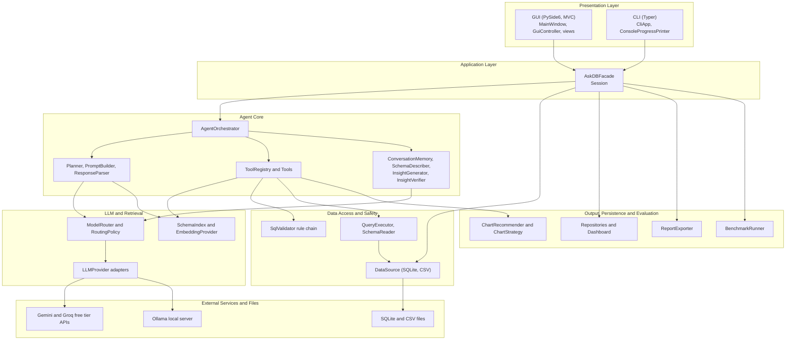

**Presentation layer.** The GUI follows MVC. The CLI is a second client. Neither contains business logic; both call `AskDBFacade`.

**Application layer.** `AskDBFacade` is the single entry point for all features and owns the current `Session` (data source, schema, schema index, conversation memory, pending clarification).

**Agent core.** `AgentOrchestrator` runs the plan, act, observe loop. `Planner` produces a `QueryPlan`. Tools are Command objects executed by `ToolRegistry`.

**LLM and retrieval.** `ModelRouter` selects a provider through a `RoutingPolicy` and handles fallback. `SchemaIndex` performs semantic search over the schema.

**Data access and safety.** `DataSource` hides whether data came from SQLite or CSV. `SqlValidator` and `QueryExecutor` guarantee safe, bounded execution.

**Output, persistence and evaluation.** Charts, history, saved questions, the dashboard, report export, and benchmark evaluation.

## 1.8 Technology Stack

| Concern | Choice |
|---|---|
| Language | Python 3.11 |
| GUI | PySide6 (Qt for Python) |
| CLI | Typer with Rich for tables and progress output |
| Data | Python `sqlite3`, pandas for CSV loading and type inference |
| Embeddings | Sentence Transformers (local MiniLM model) |
| Charts | matplotlib |
| LLM access | Google Gen AI Python SDK (Gemini), Groq through its OpenAI compatible endpoint, Ollama HTTP API; all free to use |
| Application storage | A separate SQLite file for history, saved questions, and dashboards |

The design itself is language independent. Python was chosen because it has mature libraries for LLM access, embeddings, data handling, and charts.

## 1.9 GUI and CLI

**GUI.** The main window has six tabs:

* **Ask:** question box, live progress of agent steps, and the answer panel (verified summary, SQL editor, result table, chart with a chart type selector, and buttons for Save, Pin, and Export).
* **Schema:** tree of tables and columns with types, keys, row counts, descriptions, and sample rows.
* **History:** searchable table of past questions, plus the list of saved questions.
* **Dashboard:** grid of pinned charts with a Refresh button.
* **Usage and Trace:** step by step trace of the latest request and session totals for tokens, latency, and requests used against each provider's free rate limits.
* **Evaluation:** choose a benchmark file and routing policy, run it, and view accuracy results.

A Settings dialog configures the routing policy, API keys, and whether sample rows may be sent to external models.

**CLI.** Every major feature is also available from the terminal:

| Command | Feature |
|---|---|
| `askdb import data/sample_store.db` or `askdb import orders.csv customers.csv` | F01 |
| `askdb schema [table]` | F02 |
| `askdb ask "which region grew fastest in 2025?" [--chart out.png] [--trace] [--continue]` | F03, F05, F06, F08, F09, F10 |
| `askdb shell` (interactive session with memory and clarification prompts) | F04, F10 |
| `askdb sql "SELECT ..."` | F05, F07 |
| `askdb history [--search text] [--saved]`, `askdb save ID "name"`, `askdb rerun ID` | F11 |
| `askdb pin ID`, `askdb dashboard [--refresh] [--out folder] [--remove TILE_ID]` | F12 |
| `askdb export --format pdf --out report.pdf [--last N]` | F13 |
| `askdb config --policy cheap_first`, `askdb usage` | F14 |
| `askdb eval benchmarks/store_eval.json --policy cheap_first --out eval.md` | F15 |

# 2. Detailed Feature Specifications

AskDB has 15 major features. None of them are account or housekeeping operations such as login, logout, exit, or about.

| ID | Feature | Type |
|---|---|---|
| F01 | Dataset Import | Deterministic |
| F02 | Schema Explorer with Semantic Descriptions | Hybrid |
| F03 | Natural Language Question Answering | AI |
| F04 | Ambiguity Clarification | AI |
| F05 | Query Safety Guard | Deterministic |
| F06 | Self Correcting Query Repair | Hybrid |
| F07 | SQL Review and Manual Editing | Deterministic |
| F08 | Automatic Chart Generation | Hybrid |
| F09 | Grounded Insight Summary | Hybrid |
| F10 | Follow Up Conversation Memory | AI |
| F11 | Query History and Saved Questions | Deterministic |
| F12 | Dashboard of Pinned Charts | Deterministic |
| F13 | Report Export | Deterministic |
| F14 | Model Routing and Usage Monitor | Hybrid |
| F15 | Accuracy Evaluation | Hybrid |

## F01 Dataset Import

| Field | Specification |
|---|---|
| Description | Loads a SQLite database file or one or more CSV files into a working session. CSV files are converted into tables of an in memory SQLite database with inferred column types, so the rest of the system always works through one relational interface. |
| User Interaction | GUI: File menu, Import Dataset, then choose a `.db`/`.sqlite` file or several `.csv` files. A progress bar is shown and the Schema tab opens when loading finishes. CLI: `askdb import data/sample_store.db` or `askdb import orders.csv customers.csv`. |
| Input | One SQLite file path, or one or more CSV file paths. Optional table name for each CSV. |
| Output | An active `Session` with a connected `DataSource` and a `SchemaInfo` object (tables, columns, types, keys, row counts). A confirmation message with table and row counts. |
| AI Involvement | Deterministic. |
| Expected Workflow | 1. The user selects the file(s). 2. `GuiController.on_import_clicked()` calls `AskDBFacade.import_dataset()`. 3. `DataSourceFactory.create()` chooses `SQLiteDataSource` or `CsvDataSource` from the file extension. 4. The source connects; for CSV it parses the files, infers types, and creates tables. 5. `SchemaReader.read()` builds `SchemaInfo`. 6. Schema enrichment (F02) runs. 7. The schema is displayed. |
| Error/Alternative Cases | Unsupported extension: the user sees the list of supported types. Corrupt or locked SQLite file: an error is shown and the previous session stays active. CSV without a header or with inconsistent rows: the import stops with the line number, or skipped rows are reported. Two CSV files with the same name: a numeric suffix is added to the table name. File larger than the configured limit: `FileTooLargeError` is shown with the file size and the limit, and the previous session stays active. |

## F02 Schema Explorer with Semantic Descriptions

| Field | Specification |
|---|---|
| Description | Displays every table and column with type, keys, row counts, and sample rows. The agent writes a short plain English description of each table and column using its name and a few sample values. Names and descriptions are embedded into a `SchemaIndex`, which the agent later uses to retrieve only the relevant parts of the schema for a question. |
| User Interaction | GUI: Schema tab shows a tree; selecting a table shows columns, descriptions, and five sample rows. The user can edit any description. CLI: `askdb schema` or `askdb schema orders`. |
| Input | The active session. Optional edited descriptions from the user. |
| Output | Annotated schema view and a built `SchemaIndex`. |
| AI Involvement | Hybrid. Schema reading is deterministic, descriptions come from the LLM (fast tier), and embeddings come from the local embedding model. |
| Expected Workflow | 1. `SchemaDescriber.describe()` collects sample rows for each table. 2. `PromptBuilder.build_description_prompt()` creates the prompt. 3. `ModelRouter.complete()` sends it to the fast tier. 4. `ResponseParser.parse_descriptions()` stores the descriptions in `ColumnInfo`. 5. `SchemaIndex.build()` embeds every table and column entry. 6. `SchemaView.render()` shows the result. |
| Error/Alternative Cases | LLM unavailable: descriptions are left empty, the index is built from names only, and a notice is shown. Unparseable description output: one retry, then that table is skipped. User edits a description: only that entry is embedded again. The user disabled sample sharing in Settings: descriptions are generated from names and types only. |

## F03 Natural Language Question Answering

| Field | Specification |
|---|---|
| Description | The core agent capability. The user asks a question in English; the agent retrieves relevant schema, creates a plan, and uses tools in a loop to write and run SQL until it can give a final answer with the SQL, a result table, a chart, and a verified summary. |
| User Interaction | GUI: type in the Ask box and press Ask; each agent step appears live (for example "Searching schema", "Running query"). CLI: `askdb ask "which product category grew fastest last quarter?"`. |
| Input | Question text, the active session, and the conversation memory. |
| Output | An `AgentAnswer` with status, final SQL, `QueryResult`, `ChartSpec`, verified `Insight`, and `AgentTrace`. |
| AI Involvement | AI, supported by deterministic tools. |
| Expected Workflow | 1. `AskDBFacade.ask()` calls `AgentOrchestrator.run()`. 2. `Planner.create_plan()` retrieves schema hits from `SchemaIndex` and asks the LLM for a `QueryPlan`. 3. In a loop of at most eight steps, the orchestrator builds a step prompt, gets an `AgentAction` from the LLM, and runs it through `ToolRegistry.execute()`. 4. Once a query succeeds and the model returns a final action, `MakeChartTool` builds a chart and `InsightGenerator` writes the summary. 5. `InsightVerifier.verify()` checks the summary. 6. The answer is added to memory and history and displayed. |
| Error/Alternative Cases | No dataset loaded: the user is asked to import one. Question the data cannot answer ("what will the weather be tomorrow"): status `NO_DATA` with an explanation, and no invented numbers. Step limit reached: status `FAILED` with the partial trace and a suggestion to rephrase or edit the SQL. Malformed LLM output: the parse error is returned to the model once as an observation, then the request fails gracefully. Provider timeout: handled by fallback (F14). Ambiguous question: F04. Failing query: F06. |

## F04 Ambiguity Clarification

| Field | Specification |
|---|---|
| Description | When a question has several reasonable interpretations, the agent asks the user instead of guessing. Examples: "top customers" (by revenue or by number of orders), or "sales" when both `gross_sales` and `net_sales` exist. |
| User Interaction | GUI: a clarification card with option buttons and a free text box. CLI (`askdb shell`): numbered options and a prompt for the choice. |
| Input | The question, the schema matches, and later the user's choice. |
| Output | A `ClarificationRequest`, followed by a final answer that states the chosen interpretation. |
| AI Involvement | AI. |
| Expected Workflow | 1. The planner marks the plan as ambiguous, or the model calls `AskUserTool` during the loop. 2. The orchestrator saves the `AgentState` in the session as pending. 3. The answer returns with status `NEEDS_CLARIFICATION`. 4. The user picks an option. 5. `AskDBFacade.answer_clarification()` calls `AgentOrchestrator.resume()`, which continues the loop with the clarified meaning. |
| Error/Alternative Cases | The user ignores the card and asks something else: the pending state is discarded. The reply is still ambiguous: at most two clarification rounds, after which the agent uses the most common interpretation and states the assumption in the answer. Non interactive mode (evaluation or a single CLI `ask`): the agent must state its assumption instead of asking. |

## F05 Query Safety Guard

| Field | Specification |
|---|---|
| Description | Every SQL statement, whether written by the agent or typed by the user, passes a chain of deterministic rules before execution: read only (`SELECT` or `WITH` only), a single statement, no forbidden objects or commands (`PRAGMA`, `ATTACH`, `load_extension`, system tables), and a maximum row limit. Queries also have an execution timeout, and the database connection is opened read only. |
| User Interaction | Automatic. Blocked statements show a red banner in the GUI or a message in the CLI with the reason. |
| Input | SQL text. |
| Output | A `ValidationResult`: valid (possibly rewritten with a `LIMIT`) or rejected with a reason. |
| AI Involvement | Deterministic. |
| Expected Workflow | 1. `RunQueryTool` or `AskDBFacade.run_manual_sql()` calls `SqlValidator.validate()`. 2. Each `SqlRule` checks the SQL and passes it to the next rule. 3. If all rules pass, `QueryExecutor.run()` executes it with a timeout. |
| Error/Alternative Cases | The user asks the agent to "delete the old rows": the agent explains that AskDB is read only and the answer status is `REFUSED`. Multiple statements or statements hidden after a comment: rejected by `SingleStatementRule`. Slow query: cancelled at the timeout and reported to the agent, which may simplify it. Unparseable SQL: returned to the agent as an error for repair (F06). |

## F06 Self Correcting Query Repair

| Field | Specification |
|---|---|
| Description | When a query fails (syntax error, unknown column, type mismatch) or returns a suspicious result (empty when rows were expected), the agent reads the error, inspects the schema or the distinct values of a column, and rewrites the query. It makes at most three repair attempts. Under the Cheap First policy the router escalates to the strong model from the second attempt. |
| User Interaction | Automatic. Progress shows messages such as "Attempt 2 of 3: fixing unknown column". Each attempt appears in the trace. |
| Input | The failed SQL, the error message or empty result, and schema context. |
| Output | A corrected query with its result, or a `FAILED` answer that explains what was tried. |
| AI Involvement | Hybrid. Error detection and retry limits are deterministic; the fix comes from the LLM. |
| Expected Workflow | 1. `RunQueryTool` returns a failed `ToolResult`. 2. The orchestrator increases the repair count. 3. `PromptBuilder.build_repair_prompt()` includes the SQL and error. 4. `ModelRouter.complete()` is called with the attempt number. 5. The new action goes through validation and execution again. |
| Error/Alternative Cases | The model produces the same SQL again: the loop stops early. Three attempts fail: status `FAILED` with the last error and a suggestion to edit the SQL manually (F07). The empty result is genuine: after confirming the filter values with `ColumnValuesTool`, the agent reports that no rows match instead of silently loosening the filter. |

## F07 SQL Review and Manual Editing

| Field | Specification |
|---|---|
| Description | The final SQL of every answer is shown in an editor. The user can change it and run it directly without calling the LLM. Edited SQL still goes through the safety guard. |
| User Interaction | GUI: SQL panel under each answer with a Run button. CLI: `askdb sql "SELECT region, SUM(total) FROM orders GROUP BY region"`. |
| Input | SQL text. |
| Output | Result table and chart; a history entry marked as manual. |
| AI Involvement | Deterministic. |
| Expected Workflow | 1. `GuiController.on_run_sql_clicked()` calls `AskDBFacade.run_manual_sql()`. 2. `SqlValidator.validate()` checks the statement. 3. `QueryExecutor.run()` executes it. 4. `ChartRecommender.recommend()` picks a chart. 5. `HistoryRepository.add()` records it. 6. The result is displayed. |
| Error/Alternative Cases | Rejected by the guard: the reason is shown and the editor keeps the text. SQLite error: the message is shown. No dataset loaded: the user is asked to import one. |

## F08 Automatic Chart Generation

| Field | Specification |
|---|---|
| Description | Chooses a suitable chart from the shape of the result and the chart hint in the plan: line for time series, bar for comparisons across categories, pie for a share of a total with few categories, scatter for two numeric columns, and a table or single value card otherwise. The user can switch the chart type. |
| User Interaction | GUI: chart under the result table with a chart type selector and Save Image. CLI: `--chart out.png` saves the image and the table is printed in the terminal. |
| Input | `QueryResult` and the chart hint from the `QueryPlan`. |
| Output | A `ChartSpec` rendered by `ChartView` or saved by `ChartRenderer`. |
| AI Involvement | Hybrid. The LLM suggests a chart type; deterministic strategies decide whether it suits the data and render it. |
| Expected Workflow | 1. `MakeChartTool.execute()` calls `ChartRecommender.recommend()`. 2. The hinted strategy is used if `suits()` returns true; otherwise the first suitable strategy is used. 3. `ChartStrategy.render()` returns a `ChartSpec`. 4. The chart is displayed. |
| Error/Alternative Cases | Unsuitable hint (a pie chart with 40 categories): falls back to bar. A single value result: shown as a value card. No numeric column: table only. Rendering error: the table is shown and the error is logged. |

## F09 Grounded Insight Summary

| Field | Specification |
|---|---|
| Description | Adds a two or three sentence plain English summary to each answer. `InsightVerifier` checks every number in the summary against the result, including simple derived values such as percentages. Unverified numbers cause one regeneration; if they persist, those claims are marked with a warning. |
| User Interaction | GUI: summary above the table with a "Verified" badge or a warning icon on unverified claims. CLI: summary printed with a verification line. |
| Input | The question and the result (at most 50 rows plus computed totals are sent to the model). |
| Output | An `Insight` with its verification status. |
| AI Involvement | Hybrid. The LLM writes the text; the verification is deterministic. |
| Expected Workflow | 1. `InsightGenerator.generate()` builds a prompt and calls the fast tier. 2. `ResponseParser.parse_insight()` creates the `Insight`. 3. `InsightVerifier.verify()` extracts numbers and matches them to the result within rounding tolerance. 4. On failure the summary is regenerated once with feedback. 5. The insight is attached to the answer. |
| Error/Alternative Cases | Empty result: a fixed deterministic message is used and no LLM call is made. Unusual number formats the verifier cannot parse: treated as unverified. LLM unavailable: the answer is shown without a summary. The prompt forbids causal claims not supported by the data. |

## F10 Follow Up Conversation Memory

| Field | Specification |
|---|---|
| Description | Keeps the most recent turns (question, SQL, and a short result summary) so the user can refine an answer: "now only for 2024", "break that down by region", "what about the lowest ones?". Memory is bounded and can be reset. |
| User Interaction | GUI: keep typing in the Ask box; a New Conversation button clears memory. CLI: `askdb shell` keeps memory across questions; a single `askdb ask` is stateless unless `--continue` is used. |
| Input | The follow up question and `ConversationMemory`. |
| Output | A new answer built on the previous query. |
| AI Involvement | AI. |
| Expected Workflow | 1. `ConversationMemory.context_text()` is included in the planning prompt. 2. The planner resolves references such as "that" or "those" to the previous query. 3. The flow continues as in F03. 4. `ConversationMemory.add_turn()` stores the new turn. |
| Error/Alternative Cases | Reference with no previous turn ("filter that"): the agent asks for clarification (F04). Memory limit reached: the oldest turns are dropped. Unrelated new topic: treated as a fresh question. A new dataset is imported: memory is cleared. |

## F11 Query History and Saved Questions

| Field | Specification |
|---|---|
| Description | Every answer is stored in the application database with question, SQL, status, row count, model, cost, and time. The user can search history, rerun an entry, and save questions under a name to reuse later, for example on next month's data. |
| User Interaction | GUI: History tab with a search box and actions for Rerun and Save; a Saved list beside it. CLI: `askdb history --search revenue`, `askdb save 42 "Monthly revenue"`, `askdb rerun 42`. |
| Input | Search text, entry ID, and a name for saving. |
| Output | History lists, saved question lists, and rerun answers. |
| AI Involvement | Deterministic. Rerunning executes the stored SQL without an LLM call. An "Ask again" option sends the original question through the agent instead by calling `AskDBFacade.ask(entry.question)`. |
| Expected Workflow | 1. `AskDBFacade.ask()` and `run_manual_sql()` call `HistoryRepository.add()`. 2. `get_history()` lists or searches entries. 3. `save_question()` calls `SavedQuestionRepository.save()`. 4. `rerun_history()` validates and executes the stored SQL. |
| Error/Alternative Cases | Stored SQL refers to a table that does not exist in the current dataset: an error with the option to ask the agent again. Duplicate saved name: the user is asked to rename. Damaged application database: it is recreated with a warning and the old file is kept as a backup. |

## F12 Dashboard of Pinned Charts

| Field | Specification |
|---|---|
| Description | Any answer can be pinned to a dashboard as a tile. The dashboard is stored per dataset. Refresh runs every tile query again and all views update automatically. |
| User Interaction | GUI: Pin button on an answer; Dashboard tab with a grid of tiles, Refresh, and Remove. CLI: `askdb pin 42`, `askdb dashboard --refresh --out charts/`. |
| Input | History entry ID, or a refresh command. |
| Output | Updated tiles on screen or saved chart images. |
| AI Involvement | Deterministic. |
| Expected Workflow | 1. `AskDBFacade.pin_to_dashboard()` loads the entry with `HistoryRepository.get()`. 2. A `DashboardTile` is added with `Dashboard.pin()`. 3. `Dashboard` notifies its observers and `DashboardView` redraws. 4. `DashboardRepository.save()` persists it. 5. On refresh, `Dashboard.refresh()` validates and runs each tile query, then notifies observers. |
| Error/Alternative Cases | A tile query fails after the data changed: that tile shows an error state while the others still refresh. More than 12 tiles: the user is asked to remove one first. Different dataset loaded: the dashboard for that dataset is loaded instead. |

## F13 Report Export

| Field | Specification |
|---|---|
| Description | Exports selected answers into a Markdown, HTML, or PDF report containing the dataset name, date, questions, SQL, result previews, charts, summaries, and verification status. |
| User Interaction | GUI: Export button, then choose answers, format, and location. CLI: `askdb export --format pdf --out report.pdf --last 5`. |
| Input | Selected answers, format, and output path. |
| Output | A report file. |
| AI Involvement | Deterministic. It reuses the summaries already generated. |
| Expected Workflow | 1. `AskDBFacade.export_report()` assembles `ReportData` from history. 2. `ExporterFactory.create()` returns the exporter for the format. 3. `ReportExporter.export()` runs its fixed sequence: header, one section per entry, footer, save. 4. `ChartRenderer.to_image()` renders charts. 5. The file path is returned. |
| Error/Alternative Cases | Nothing selected: the user is told to select at least one answer. Unsupported format: the supported formats are listed. Path not writable: an error with the option to choose another location. PDF library unavailable: falls back to HTML with a notice. |

## F14 Model Routing and Usage Monitor

| Field | Specification |
|---|---|
| Description | The user selects a routing policy: **Cheap First** (fast model first, strong model for repairs and parse failures), **Strong Only**, or **Local Only** (Ollama, offline, no data leaves the machine). All three policies use only free models. The router retries rate limited calls with exponential backoff and then falls back to another available free provider, ending with the local model. The Usage and Trace tab shows each agent step (tool, model, tokens, latency) and session totals, including requests used against each provider's free rate limits. The cost field is always zero with the free configuration; it is kept so the design would still report correctly if a paid provider were ever added. |
| User Interaction | GUI: Settings dialog for the policy; Usage and Trace tab. CLI: `askdb config --policy local_only`, `askdb usage`, and `--trace` on `askdb ask`. |
| Input | Policy name; agent events produced during requests. |
| Output | Active policy, per step trace, and a `UsageSummary`. |
| AI Involvement | Hybrid. Deterministic routing and accounting around AI calls. |
| Expected Workflow | 1. `AskDBFacade.set_routing_policy()` makes sure providers exist through `LLMProviderFactory.create()` and calls `ModelRouter.set_policy()`. 2. During a request, `ModelRouter.complete()` asks `RoutingPolicy.select()` for a provider and calls it. 3. The orchestrator publishes an `AgentEvent` for each step. 4. `TraceView`, `ConsoleProgressPrinter`, and `UsageTracker` receive it. 5. `get_usage_summary()` returns totals. |
| Error/Alternative Cases | Missing API key: that policy is unavailable and the user sees setup instructions, or Local Only is used if Ollama is running. Provider timeout or rate limit: the next provider is tried and the fallback is logged. Ollama not running: a clear message. Local model cost: reported as zero. |

## F15 Accuracy Evaluation

| Field | Specification |
|---|---|
| Description | Runs the agent over a benchmark of questions with reference ("gold") SQL, compares the result of the agent's query with the result of the gold query, and reports execution accuracy, abstention rate, average latency, total cost, and a list of failures. The benchmark combines a curated question set on our own sample datasets and a subset of a public text to SQL benchmark (Spider or BIRD). It is used to compare routing policies and prompt versions. |
| User Interaction | GUI: Evaluation tab to choose a benchmark and policy, run, and view results. CLI: `askdb eval benchmarks/store_eval.json --policy cheap_first --out eval.md`. |
| Input | Benchmark JSON file (case ID, database path, question, gold SQL) and a routing policy. |
| Output | An `EvaluationReport` shown on screen and saved as Markdown. |
| AI Involvement | Hybrid. The agent is AI; scoring is deterministic. |
| Expected Workflow | 1. `BenchmarkLoader.load()` reads the file. 2. `BenchmarkRunner.run()` loops over cases. 3. For each case a fresh session is created with `DataSourceFactory.create()` and `AgentOrchestrator.run()` answers in non interactive mode. 4. The gold SQL is run with `QueryExecutor.run()`. 5. `ResultComparator.equivalent()` compares the two results. 6. Totals are collected in the report. |
| Error/Alternative Cases | Malformed benchmark file: validation errors with the case ID. Gold SQL fails: the case is marked invalid and excluded. The agent refuses or asks for clarification: counted as an abstention. The run is interrupted: a partial report is saved. |

# 3. UML Class Diagram

The class diagram is large, so it is presented as one package overview followed by five detailed views. Together the views form a single model: a class that appears in more than one view is the same class, and classes shown without members in a view are fully specified in the view named in the note beside it. Stereotypes `<<interface>>`, `<<abstract>>`, and `<<enumeration>>` are used where appropriate.

## 3.1 Package Overview

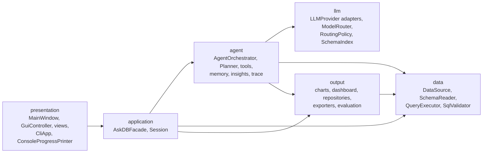

## 3.2 View A: Presentation and Application Layer

```mermaid
classDiagram
    class MainWindow {
        -controller: GuiController
        -query_panel: QueryPanel
        -schema_view: SchemaView
        -result_view: ResultView
        -chart_view: ChartView
        -history_view: HistoryView
        -dashboard_view: DashboardView
        -trace_view: TraceView
        -evaluation_view: EvaluationView
        -event_bridge: QtEventBridge
        +show()
        +show_schema(schema: SchemaInfo)
        +display_answer(answer: AgentAnswer)
        +show_clarification(request: ClarificationRequest)
        +show_history(entries: list)
        +show_usage(summary: UsageSummary)
        +show_message(text: str)
        +show_error(message: str)
    }
    class GuiController {
        -facade: AskDBFacade
        -window: MainWindow
        +on_import_clicked(paths: list)
        +on_ask_clicked(question: str)
        +on_clarification_chosen(choice: str)
        +on_new_conversation_clicked()
        +on_run_sql_clicked(sql: str)
        +on_history_search(text: str)
        +on_save_clicked(entry_id: int, name: str)
        +on_rerun_clicked(entry_id: int)
        +on_pin_clicked(entry_id: int)
        +on_unpin_clicked(tile_id: int)
        +on_refresh_dashboard_clicked()
        +on_chart_type_changed(chart_type: str)
        +on_export_clicked(entry_ids: list, fmt: str, path: str)
        +on_policy_changed(policy_name: str)
        +on_usage_tab_opened()
        +on_evaluate_clicked(benchmark_path: str)
    }
    class QueryPanel {
        -question_box: QLineEdit
        -sql_editor: QTextEdit
        +get_question() str
        +get_sql() str
        +set_sql(sql: str)
    }
    class SchemaView {
        +render(schema: SchemaInfo)
    }
    class ResultView {
        +render(result: QueryResult)
    }
    class ChartView {
        +render(spec: ChartSpec)
    }
    class EvaluationView {
        +show_report(report: EvaluationReport)
    }
    class HistoryView {
        +render(entries: List~HistoryEntry~, saved: List~SavedQuestion~)
        +selected_entry_ids() list
    }
    class SettingsDialog {
        +get_policy() str
        +get_allow_sample_rows() bool
        +exec() bool
    }
    class QtEventBridge {
        +event_received: Signal
        +on_event(event: AgentEvent)
    }
    class DashboardView {
        +on_dashboard_changed(dashboard: Dashboard)
    }
    class TraceView {
        +on_event(event: AgentEvent)
    }
    class AgentEventListener {
        <<interface>>
        +on_event(event: AgentEvent)
    }
    class DashboardObserver {
        <<interface>>
        +on_dashboard_changed(dashboard: Dashboard)
    }
    class CliApp {
        -facade: AskDBFacade
        -printer: ConsoleProgressPrinter
        +import_cmd(paths: list)
        +schema_cmd(table: str)
        +ask_cmd(question: str, chart_path: str, trace: bool, continue_: bool)
        +shell_cmd()
        +sql_cmd(sql: str)
        +history_cmd(search: str, saved: bool)
        +save_cmd(entry_id: int, name: str)
        +rerun_cmd(entry_id: int)
        +pin_cmd(entry_id: int)
        +dashboard_cmd(refresh: bool, out_dir: str, remove: int)
        +export_cmd(fmt: str, out: str, last: int)
        +config_cmd(policy: str)
        +usage_cmd()
        +eval_cmd(benchmark_path: str, policy: str, out: str)
    }
    class ConsoleProgressPrinter {
        +on_event(event: AgentEvent)
    }
    class AskDBFacade {
        -session: Session
        -orchestrator: AgentOrchestrator
        -source_factory: DataSourceFactory
        -schema_reader: SchemaReader
        -schema_describer: SchemaDescriber
        -validator: SqlValidator
        -executor: QueryExecutor
        -chart_recommender: ChartRecommender
        -history_repo: HistoryRepository
        -saved_repo: SavedQuestionRepository
        -dashboard: Dashboard
        -dashboard_repo: DashboardRepository
        -exporter_factory: ExporterFactory
        -router: ModelRouter
        -provider_factory: LLMProviderFactory
        -usage_tracker: UsageTracker
        -benchmark_runner: BenchmarkRunner
        +import_dataset(paths: list) SchemaInfo
        +get_schema() SchemaInfo
        +update_description(table: str, column: str, text: str)
        +ask(question: str) AgentAnswer
        +answer_clarification(choice: str) AgentAnswer
        +reset_conversation()
        +run_manual_sql(sql: str) AgentAnswer
        +get_history(limit: int, search: str) List~HistoryEntry~
        +rerun_history(entry_id: int) AgentAnswer
        +save_question(entry_id: int, name: str)
        +list_saved() List~SavedQuestion~
        +pin_to_dashboard(entry_id: int)
        +unpin_from_dashboard(tile_id: int)
        +refresh_dashboard()
        +build_chart(result: QueryResult, chart_type: str) ChartSpec
        +export_report(entry_ids: list, fmt: str, path: str) str
        +set_routing_policy(policy_name: str)
        +get_usage_summary() UsageSummary
        +run_evaluation(benchmark_path: str, policy_name: str) EvaluationReport
        +add_listener(listener: AgentEventListener)
        +add_dashboard_observer(observer: DashboardObserver)
    }
    class Session {
        +dataset_name: str
        +data_source: DataSource
        +schema: SchemaInfo
        +schema_index: SchemaIndex
        +memory: ConversationMemory
        +pending_state: AgentState
        +interactive: bool
        +has_pending_clarification() bool
    }

    MainWindow "1" *-- "1" QueryPanel
    MainWindow "1" *-- "1" SchemaView
    MainWindow "1" *-- "1" ResultView
    MainWindow "1" *-- "1" ChartView
    MainWindow "1" *-- "1" DashboardView
    MainWindow "1" *-- "1" TraceView
    MainWindow "1" *-- "1" EvaluationView
    MainWindow "1" *-- "1" HistoryView
    MainWindow "1" *-- "1" QtEventBridge
    MainWindow ..> SettingsDialog : opens
    MainWindow "1" --> "1" GuiController : forwards user actions
    GuiController "1" --> "1" MainWindow : updates
    GuiController "1" --> "1" AskDBFacade
    CliApp "1" --> "1" AskDBFacade
    CliApp "1" *-- "1" ConsoleProgressPrinter
    AgentEventListener <|.. TraceView
    AgentEventListener <|.. ConsoleProgressPrinter
    AgentEventListener <|.. QtEventBridge
    QtEventBridge ..> TraceView : re-emits events on the UI thread
    DashboardObserver <|.. DashboardView
    AskDBFacade "1" *-- "0..1" Session : current session
    AskDBFacade --> AgentOrchestrator
    AskDBFacade ..> AgentAnswer : returns
```

Note: `AgentOrchestrator`, `AgentAnswer`, `AgentState`, `ConversationMemory`, and `UsageTracker` are detailed in View B. `ModelRouter`, `LLMProviderFactory`, and `SchemaIndex` are in View C. `DataSource`, `SchemaReader`, `SqlValidator`, and `QueryExecutor` are in View D. Charts, repositories, the dashboard, exporters, and evaluation classes are in View E.

## 3.3 View B: Agent Core and Tools

```mermaid
classDiagram
    class AgentOrchestrator {
        -planner: Planner
        -prompt_builder: PromptBuilder
        -parser: ResponseParser
        -router: ModelRouter
        -tools: ToolRegistry
        -insight_generator: InsightGenerator
        -insight_verifier: InsightVerifier
        -listeners: List~AgentEventListener~
        -max_steps: int
        -max_repairs: int
        -max_clarifications: int
        +run(question: str, session: Session) AgentAnswer
        +resume(choice: str, session: Session) AgentAnswer
        +add_listener(listener: AgentEventListener)
        -loop(state: AgentState, session: Session) AgentAnswer
        -next_action(state: AgentState) AgentAction
        -handle_failure(state: AgentState, result: ToolResult)
        -pause_for_clarification(state: AgentState, request: ClarificationRequest, session: Session) AgentAnswer
        -finalize(state: AgentState, action: AgentAction, session: Session) AgentAnswer
        -finalize_refused(state: AgentState) AgentAnswer
        -finalize_no_data(state: AgentState) AgentAnswer
        -finalize_failed(state: AgentState, reason: str) AgentAnswer
        -notify(event: AgentEvent)
    }
    class Planner {
        -prompt_builder: PromptBuilder
        -parser: ResponseParser
        -router: ModelRouter
        +create_plan(question: str, context: str, index: SchemaIndex) QueryPlan
    }
    class PromptBuilder {
        -templates: dict
        +build_plan_prompt(question: str, context: str, hits: list) list
        +build_step_prompt(state: AgentState, tool_specs: list) list
        +build_repair_prompt(state: AgentState, error: str) list
        +build_insight_prompt(question: str, result: QueryResult) list
        +build_description_prompt(table: TableInfo, samples: QueryResult) list
    }
    class ResponseParser {
        +parse_plan(text: str) QueryPlan
        +parse_action(text: str) AgentAction
        +parse_insight(text: str) Insight
        +parse_descriptions(text: str) dict
    }
    class AgentState {
        +question: str
        +plan: QueryPlan
        +observations: list
        +step_count: int
        +repair_count: int
        +clarification_count: int
        +last_sql: str
        +last_result: QueryResult
        +successful_query: bool
        +seen_sql: set
        +clarified_meaning: str
        +trace: AgentTrace
    }
    class QueryPlan {
        +intent: str
        +category: str
        +relevant_tables: list
        +steps: list
        +chart_hint: str
        +needs_clarification: bool
        +clarification: ClarificationRequest
    }
    class AgentAction {
        +kind: str
        +tool_name: str
        +arguments: dict
        +final_status: AnswerStatus
        +final_text: str
        +reason: str
        +is_final() bool
    }
    class ToolRegistry {
        -tools: dict
        +register(tool: Tool)
        +get(name: str) Tool
        +specs() list
        +execute(action: AgentAction, session: Session) ToolResult
    }
    class Tool {
        <<interface>>
        +name() str
        +description() str
        +parameters_schema() dict
        +validate_args(args: dict) bool
        +execute(args: dict, session: Session) ToolResult
    }
    class SearchSchemaTool {
        +execute(args: dict, session: Session) ToolResult
    }
    class SampleRowsTool {
        -max_rows: int
        +execute(args: dict, session: Session) ToolResult
    }
    class ColumnValuesTool {
        -max_values: int
        +execute(args: dict, session: Session) ToolResult
    }
    class RunQueryTool {
        -validator: SqlValidator
        -executor: QueryExecutor
        +execute(args: dict, session: Session) ToolResult
    }
    class MakeChartTool {
        -recommender: ChartRecommender
        +execute(args: dict, session: Session) ToolResult
    }
    class AskUserTool {
        +execute(args: dict, session: Session) ToolResult
    }
    class ToolResult {
        +ok: bool
        +data: object
        +error: str
        +summary_for_model(max_rows: int) str
    }
    class ConversationMemory {
        -turns: List~Turn~
        -max_turns: int
        +add_turn(turn: Turn)
        +context_text() str
        +last_turn() Turn
        +clear()
    }
    class Turn {
        +question: str
        +sql: str
        +result_summary: str
    }
    class SchemaDescriber {
        -prompt_builder: PromptBuilder
        -parser: ResponseParser
        -router: ModelRouter
        +describe(schema: SchemaInfo, source: DataSource, allow_samples: bool) SchemaInfo
    }
    class InsightGenerator {
        -prompt_builder: PromptBuilder
        -parser: ResponseParser
        -router: ModelRouter
        +generate(question: str, result: QueryResult, feedback: str) Insight
    }
    class InsightVerifier {
        -tolerance: float
        +verify(insight: Insight, result: QueryResult) VerificationReport
    }
    class Insight {
        +text: str
        +verified: bool
        +unverified_numbers: list
    }
    class VerificationReport {
        +all_verified: bool
        +checked_numbers: list
        +unverified_numbers: list
    }
    class AgentAnswer {
        +status: AnswerStatus
        +question: str
        +sql: str
        +result: QueryResult
        +chart: ChartSpec
        +insight: Insight
        +clarification: ClarificationRequest
        +message: str
        +trace: AgentTrace
    }
    class AnswerStatus {
        <<enumeration>>
        ANSWERED
        NEEDS_CLARIFICATION
        REFUSED
        NO_DATA
        FAILED
    }
    class ClarificationRequest {
        +prompt: str
        +options: list
    }
    class AgentTrace {
        -steps: List~TraceStep~
        +record(step: TraceStep)
        +total_tokens() int
        +total_cost() float
        +total_latency_ms() int
        +to_json() str
    }
    class TraceStep {
        +kind: str
        +model: str
        +tool_name: str
        +tokens_in: int
        +tokens_out: int
        +latency_ms: int
        +cost: float
        +detail: str
    }
    class AgentEvent {
        +kind: str
        +step: TraceStep
        +message: str
        +timestamp: datetime
    }
    class AgentEventListener {
        <<interface>>
        +on_event(event: AgentEvent)
    }
    class UsageTracker {
        -session_steps: List~TraceStep~
        +on_event(event: AgentEvent)
        +summary() UsageSummary
        +reset()
    }
    class UsageSummary {
        +requests: int
        +tokens_in: int
        +tokens_out: int
        +estimated_cost: float
        +avg_latency_ms: int
        +by_model: dict
        +requests_by_provider: dict
        +quota_by_provider: dict
    }

    AgentOrchestrator "1" *-- "1" Planner
    AgentOrchestrator "1" --> "1" ToolRegistry
    AgentOrchestrator "1" --> "1" InsightGenerator
    AgentOrchestrator "1" --> "1" InsightVerifier
    AgentOrchestrator "1" o-- "0..*" AgentEventListener : notifies
    AgentOrchestrator ..> AgentState : creates
    AgentOrchestrator ..> AgentAnswer : returns
    AgentOrchestrator ..> AgentEvent : publishes
    Planner ..> QueryPlan : creates
    Planner --> PromptBuilder
    Planner --> ResponseParser
    ResponseParser ..> AgentAction : creates
    ToolRegistry "1" o-- "1..*" Tool
    Tool <|.. SearchSchemaTool
    Tool <|.. SampleRowsTool
    Tool <|.. ColumnValuesTool
    Tool <|.. RunQueryTool
    Tool <|.. MakeChartTool
    Tool <|.. AskUserTool
    Tool ..> ToolResult : returns
    AgentState "1" *-- "1" AgentTrace
    AgentState --> QueryPlan
    AgentTrace "1" *-- "0..*" TraceStep
    ConversationMemory "1" *-- "0..*" Turn
    InsightGenerator ..> Insight : creates
    InsightVerifier ..> VerificationReport : creates
    AgentAnswer --> AnswerStatus
    AgentAnswer "1" *-- "0..1" Insight
    AgentAnswer "1" *-- "0..1" ClarificationRequest
    AgentAnswer "1" --> "1" AgentTrace
    AgentEventListener <|.. UsageTracker
    UsageTracker ..> UsageSummary : creates
```

## 3.4 View C: LLM Access, Routing and Retrieval

```mermaid
classDiagram
    class LLMProvider {
        <<interface>>
        +complete(messages: list, max_tokens: int) LLMResponse
        +model_name() str
        +tier() str
        +is_available() bool
        +cost(tokens_in: int, tokens_out: int) float
    }
    class GeminiAdapter {
        -client: GeminiClient
        -model: str
        +complete(messages: list, max_tokens: int) LLMResponse
    }
    class GroqAdapter {
        -client: GroqClient
        -model: str
        +complete(messages: list, max_tokens: int) LLMResponse
    }
    class OllamaAdapter {
        -base_url: str
        -model: str
        +complete(messages: list, max_tokens: int) LLMResponse
    }
    class MockLLMProvider {
        -scripted_responses: list
        +complete(messages: list, max_tokens: int) LLMResponse
    }
    class GeminiClient {
        <<external>>
        +generate_content(model, contents, config)
    }
    class GroqClient {
        <<external>>
        +chat_completions_create(model, messages)
    }
    class LLMResponse {
        +text: str
        +model: str
        +tokens_in: int
        +tokens_out: int
        +latency_ms: int
        +cost: float
    }
    class LLMProviderFactory {
        -config: AppConfig
        +create(provider_name: str) LLMProvider
    }
    class ModelRouter {
        -policy: RoutingPolicy
        -providers: dict
        -timeout_s: int
        -max_rate_limit_retries: int
        -event_sink: Callable~AgentEvent~
        +complete(messages: list, task: str, attempt: int) LLMResponse
        +set_policy(policy: RoutingPolicy)
        +add_provider(provider: LLMProvider)
        -fallback(failed: LLMProvider, messages: list) LLMResponse
    }
    class RoutingPolicy {
        <<interface>>
        +select(task: str, attempt: int, providers: dict) LLMProvider
        +name() str
    }
    class CheapFirstPolicy {
        +select(task: str, attempt: int, providers: dict) LLMProvider
    }
    class StrongOnlyPolicy {
        +select(task: str, attempt: int, providers: dict) LLMProvider
    }
    class LocalOnlyPolicy {
        +select(task: str, attempt: int, providers: dict) LLMProvider
    }
    class EmbeddingProvider {
        <<interface>>
        +embed(texts: list) list
    }
    class LocalEmbeddingProvider {
        -model_name: str
        +embed(texts: list) list
    }
    class HashEmbeddingProvider {
        -dimensions: int
        +embed(texts: list) list
    }
    class LLMError {
        <<exception>>
        +kind: str
        +provider: str
        +message: str
    }
    class SchemaIndex {
        -entries: List~SchemaEntry~
        -embedder: EmbeddingProvider
        +build(schema: SchemaInfo)
        +update_entry(table: str, column: str)
        +search(query: str, k: int) List~SchemaEntry~
    }
    class SchemaEntry {
        +table: str
        +column: str
        +text: str
        +vector: list
        +score: float
    }
    class AppConfig {
        +api_keys: dict
        +default_policy: str
        +allow_sample_rows: bool
        +load(path: str) AppConfig
    }

    LLMProvider <|.. GeminiAdapter
    LLMProvider <|.. GroqAdapter
    LLMProvider <|.. OllamaAdapter
    LLMProvider <|.. MockLLMProvider
    GeminiAdapter --> GeminiClient : adapts
    GroqAdapter --> GroqClient : adapts
    LLMProvider ..> LLMResponse : returns
    LLMProviderFactory ..> LLMProvider : creates
    LLMProviderFactory --> AppConfig
    ModelRouter "1" o-- "1..*" LLMProvider
    ModelRouter "1" --> "1" RoutingPolicy : current strategy
    RoutingPolicy <|.. CheapFirstPolicy
    RoutingPolicy <|.. StrongOnlyPolicy
    RoutingPolicy <|.. LocalOnlyPolicy
    EmbeddingProvider <|.. LocalEmbeddingProvider
    EmbeddingProvider <|.. HashEmbeddingProvider
    LLMProvider ..> LLMError : raises
    ModelRouter ..> AgentEvent : reports through event_sink
    SchemaIndex "1" --> "1" EmbeddingProvider
    SchemaIndex "1" *-- "0..*" SchemaEntry
```

## 3.5 View D: Data Access and Query Safety

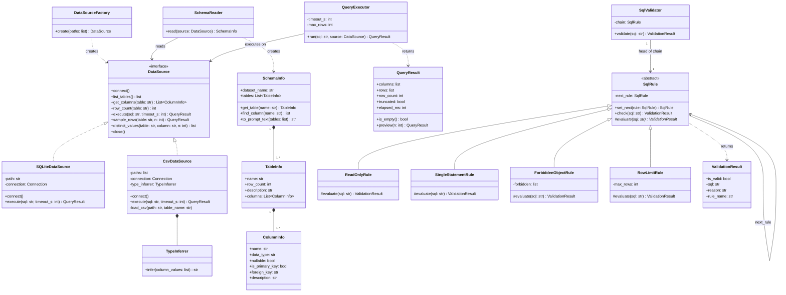

## 3.6 View E: Output, Persistence and Evaluation

```mermaid
classDiagram
    class ChartRecommender {
        -strategies: List~ChartStrategy~
        +recommend(result: QueryResult, hint: str) ChartStrategy
        +build(result: QueryResult, hint: str) ChartSpec
    }
    class ChartStrategy {
        <<interface>>
        +chart_type() str
        +suits(result: QueryResult) bool
        +render(result: QueryResult) ChartSpec
    }
    class BarChartStrategy
    class LineChartStrategy
    class PieChartStrategy
    class ScatterChartStrategy
    class TableOnlyStrategy
    class ChartSpec {
        +chart_type: str
        +title: str
        +x_column: str
        +y_columns: list
        +data: list
    }
    class ChartRenderer {
        +to_image(spec: ChartSpec, path: str) str
    }
    class Dashboard {
        -dataset_name: str
        -tiles: List~DashboardTile~
        -observers: List~DashboardObserver~
        -max_tiles: int
        +pin(tile: DashboardTile)
        +unpin(tile_id: int)
        +refresh(source: DataSource, validator: SqlValidator, executor: QueryExecutor)
        +attach(observer: DashboardObserver)
        +detach(observer: DashboardObserver)
        -notify()
    }
    class DashboardTile {
        +tile_id: int
        +title: str
        +sql: str
        +chart_type: str
        +last_result: QueryResult
        +error: str
    }
    class DashboardObserver {
        <<interface>>
        +on_dashboard_changed(dashboard: Dashboard)
    }
    class HistoryRepository {
        -db: AppDatabase
        +add(entry: HistoryEntry) int
        +get(entry_id: int) HistoryEntry
        +list(limit: int) List~HistoryEntry~
        +search(text: str) List~HistoryEntry~
    }
    class SavedQuestionRepository {
        -db: AppDatabase
        +save(item: SavedQuestion)
        +list() List~SavedQuestion~
        +delete(saved_id: int)
    }
    class DashboardRepository {
        -db: AppDatabase
        +save(dashboard: Dashboard)
        +load(dataset_name: str) Dashboard
    }
    class AppDatabase {
        -path: str
        +connection() Connection
        +migrate()
    }
    class HistoryEntry {
        +entry_id: int
        +dataset_name: str
        +question: str
        +sql: str
        +status: str
        +row_count: int
        +summary: str
        +chart_type: str
        +model: str
        +cost: float
        +created_at: datetime
        +manual: bool
    }
    class SavedQuestion {
        +saved_id: int
        +name: str
        +question: str
        +sql: str
    }
    class ReportExporter {
        <<abstract>>
        -renderer: ChartRenderer
        +export(data: ReportData, path: str) str
        #write_header(data: ReportData)*
        #write_entry(entry: HistoryEntry, chart_path: str)*
        #write_footer(data: ReportData)*
        #save(path: str)*
    }
    class MarkdownExporter
    class HtmlExporter
    class PdfExporter
    class ExporterFactory {
        +create(fmt: str) ReportExporter
    }
    class ReportData {
        +title: str
        +dataset_name: str
        +entries: List~HistoryEntry~
        +generated_at: datetime
    }
    class BenchmarkLoader {
        +load(path: str) Benchmark
    }
    class Benchmark {
        +name: str
        +cases: List~BenchmarkCase~
    }
    class BenchmarkCase {
        +case_id: str
        +db_path: str
        +question: str
        +gold_sql: str
    }
    class BenchmarkRunner {
        -orchestrator: AgentOrchestrator
        -source_factory: DataSourceFactory
        -executor: QueryExecutor
        -comparator: ResultComparator
        +run(benchmark: Benchmark) EvaluationReport
    }
    class ResultComparator {
        +equivalent(predicted: QueryResult, gold: QueryResult) bool
    }
    class EvaluationReport {
        +total: int
        +correct: int
        +abstained: int
        +invalid: int
        +accuracy: float
        +avg_latency_ms: int
        +total_cost: float
        +failures: list
        +to_markdown() str
    }

    ChartRecommender "1" o-- "1..*" ChartStrategy
    ChartStrategy <|.. BarChartStrategy
    ChartStrategy <|.. LineChartStrategy
    ChartStrategy <|.. PieChartStrategy
    ChartStrategy <|.. ScatterChartStrategy
    ChartStrategy <|.. TableOnlyStrategy
    ChartStrategy ..> ChartSpec : creates
    ChartRenderer ..> ChartSpec : draws
    Dashboard "1" *-- "0..12" DashboardTile
    Dashboard "1" o-- "0..*" DashboardObserver : notifies
    DashboardRepository ..> Dashboard : persists
    HistoryRepository --> AppDatabase
    SavedQuestionRepository --> AppDatabase
    DashboardRepository --> AppDatabase
    HistoryRepository ..> HistoryEntry
    SavedQuestionRepository ..> SavedQuestion
    ReportExporter <|-- MarkdownExporter
    ReportExporter <|-- HtmlExporter
    ReportExporter <|-- PdfExporter
    ReportExporter --> ChartRenderer
    ReportExporter ..> ReportData : uses
    ExporterFactory ..> ReportExporter : creates
    ReportData "1" o-- "1..*" HistoryEntry
    BenchmarkLoader ..> Benchmark : creates
    Benchmark "1" *-- "1..*" BenchmarkCase
    BenchmarkRunner --> ResultComparator
    BenchmarkRunner ..> EvaluationReport : creates
```

## 3.7 Responsibilities of the Main Classes

| Class | Responsibility |
|---|---|
| `AskDBFacade` | Single entry point for GUI and CLI; coordinates subsystems for every feature |
| `Session` | Holds the state of the currently loaded dataset and conversation |
| `AgentOrchestrator` | Runs the plan, act, observe loop; enforces step, repair, and clarification limits; publishes events |
| `Planner` | Retrieves relevant schema and asks the LLM for a `QueryPlan` |
| `PromptBuilder` / `ResponseParser` | Build every prompt from templates; convert model output into typed objects |
| `ToolRegistry` / `Tool` | Register, describe, validate, and execute the agent's tools |
| `ModelRouter` / `RoutingPolicy` | Choose a model for each call, escalate on repeated failure, fall back on provider errors |
| `LLMProvider` adapters | Hide vendor SDK differences behind one interface |
| `SchemaIndex` | Semantic search over schema entries using embeddings |
| `DataSource` / `DataSourceFactory` | Uniform relational access to SQLite and CSV data |
| `SqlValidator` / `SqlRule` | Deterministic safety chain for all SQL |
| `QueryExecutor` | Bounded, timed execution of validated SQL |
| `InsightGenerator` / `InsightVerifier` | Write summaries and check every number against the result |
| `ChartRecommender` / `ChartStrategy` | Select and build suitable charts |
| `Dashboard` | Holds pinned tiles and notifies views on change |
| Repositories | Persist history, saved questions, and dashboards |
| `ReportExporter` | Fixed report generation algorithm with format specific steps |
| `BenchmarkRunner` / `ResultComparator` | Measure agent accuracy against gold queries |

Note on `QueryPlan.category`: the planner classifies every request as `query`, `destructive` (a request to change data), or `unanswerable` (the schema cannot answer it). This lets the orchestrator refuse or decline early without calling any tools. `AgentState.successful_query` prevents the agent from giving a final answer before any query has succeeded, and `seen_sql` lets the orchestrator detect a repair loop that keeps producing the same failing SQL.

# 4. Design Pattern Explanations

AskDB applies nine design patterns. Eight come from the course list: Facade, Adapter, Strategy, Command, Observer, Template Method, Factory Method, and MVC. The ninth, Chain of Responsibility, is an additional pattern that solves the query safety problem. Each one was chosen because it solves a specific problem in this application, not to reach a count.

## 4.1 Facade

| Question | Answer |
|---|---|
| Design problem | Two different interfaces (GUI and CLI) must offer the same 15 features. Each feature involves several subsystems: the agent, data sources, the validator, repositories, the dashboard, exporters, the router, and evaluation. |
| Participating classes | `AskDBFacade` (Facade); `GuiController` and `CliApp` (Clients); `AgentOrchestrator`, `DataSourceFactory`, `SchemaReader`, `SchemaDescriber`, `SqlValidator`, `QueryExecutor`, `ChartRecommender`, `HistoryRepository`, `SavedQuestionRepository`, `Dashboard`, `DashboardRepository`, `ExporterFactory`, `ModelRouter`, `LLMProviderFactory`, `UsageTracker`, `BenchmarkRunner` (Subsystem classes) |
| Roles | The facade exposes one simple method per user goal (`import_dataset`, `ask`, `run_manual_sql`, `export_report`, and so on) and coordinates the subsystem calls. Clients only translate user input into facade calls and display the results. |
| Why appropriate | It guarantees that the GUI and CLI behave identically, which the project requires, and it keeps the presentation layer independent of the internal structure. |
| Without it | Both interfaces would repeat the same orchestration logic and depend on about twenty classes each. The two copies would drift apart, and every internal change would require editing both interfaces. |

## 4.2 Adapter

| Question | Answer |
|---|---|
| Design problem | Each LLM vendor has a different SDK, message format, error types, and token usage fields. Separately, CSV files are not relational, yet the agent needs to run SQL on them. |
| Participating classes | LLM access: `LLMProvider` (Target), `GeminiAdapter`, `GroqAdapter`, `OllamaAdapter` (Adapters), `GeminiClient`, `GroqClient`, Ollama HTTP API (Adaptees), `ModelRouter` (Client). Data access: `DataSource` (Target), `CsvDataSource` (Adapter), CSV files loaded through pandas (Adaptee), `QueryExecutor` and the tools (Clients). |
| Roles | Each adapter converts the neutral message list into the vendor format, calls the vendor, and converts the response into an `LLMResponse`. `CsvDataSource` loads CSV files into an in memory SQLite database and exposes them through the same `DataSource` interface as a real database. |
| Why appropriate | The agent code depends only on `LLMProvider` and `DataSource`, so providers and data formats can be added or swapped without touching the agent. It also allows `MockLLMProvider` to replace real models in tests. |
| Without it | Vendor specific code would spread through the planner, orchestrator, describer, and insight generator. Supporting local models or a second vendor would mean editing all of them, and deterministic testing of the agent pipeline would be impossible. |

## 4.3 Strategy

| Question | Answer |
|---|---|
| Design problem | Two families of algorithms vary and must be chosen at runtime: how to choose a model for each LLM call, and how to visualize a query result. |
| Participating classes | Routing: `ModelRouter` (Context), `RoutingPolicy` (Strategy), `CheapFirstPolicy`, `StrongOnlyPolicy`, `LocalOnlyPolicy` (Concrete strategies). Charts: `ChartRecommender` (Context), `ChartStrategy` (Strategy), `BarChartStrategy`, `LineChartStrategy`, `PieChartStrategy`, `ScatterChartStrategy`, `TableOnlyStrategy` (Concrete strategies). |
| Roles | The contexts delegate the decision to the current strategy object. The user changes the routing policy in Settings; the chart strategy is chosen from the result shape and the plan's hint, and the user can switch it. |
| Why appropriate | Each algorithm is small, independent, and separately testable. New policies or chart types can be added without modifying existing ones (open/closed principle). |
| Without it | `ModelRouter` and `ChartRecommender` would contain long conditional chains. Adding a policy or chart type would mean editing and retesting existing code, and the evaluation feature could not compare policies cleanly. |

## 4.4 Command

| Question | Answer |
|---|---|
| Design problem | The LLM decides at runtime which operation to perform. Every operation must be describable to the model, validated before execution, executed in a uniform way, timed, and recorded in the trace. |
| Participating classes | `Tool` (Command interface); `SearchSchemaTool`, `SampleRowsTool`, `ColumnValuesTool`, `RunQueryTool`, `MakeChartTool`, `AskUserTool` (Concrete commands); `ToolRegistry` (Invoker); `AgentOrchestrator` (Client, turns each parsed `AgentAction` into an invocation); `SchemaIndex`, `DataSource`, `SqlValidator`, `QueryExecutor`, `ChartRecommender` (Receivers). |
| Roles | Each tool packages a request as an object with a name, description, parameter schema, argument validation, and `execute()`. The registry looks up the tool named in the action, validates the arguments, and runs it. |
| Why appropriate | The agent's action space becomes a set of interchangeable objects. `ToolRegistry.specs()` generates the tool descriptions for the prompt automatically, and every call is validated and logged in one place. |
| Without it | The orchestrator would need a large switch on tool names with validation and logging repeated in each branch. Adding a tool would require editing the orchestrator and the prompt by hand. |

## 4.5 Observer

| Question | Answer |
|---|---|
| Design problem | Several parts of the system must react to agent progress and dashboard changes (the GUI trace and progress list, the CLI progress printer, the usage tracker, the dashboard view), but the agent and the dashboard must not depend on the GUI or CLI. |
| Participating classes | Agent events: `AgentOrchestrator` (Subject), `AgentEventListener` (Observer interface), `TraceView`, `ConsoleProgressPrinter`, `UsageTracker` (Concrete observers), `AgentEvent` (notification data). Dashboard: `Dashboard` (Subject), `DashboardObserver` (Observer interface), `DashboardView` (Concrete observer). |
| Roles | Subjects keep a list of observers and call `notify()` whenever something changes. Observers decide independently how to react. |
| Why appropriate | It keeps the dependency direction correct (presentation depends on the core, never the reverse). New observers can be added without changing the agent. |
| Without it | The orchestrator would call GUI methods directly, breaking the layering. The CLI could not reuse the agent, and views would have to poll for changes. |

## 4.6 Template Method

| Question | Answer |
|---|---|
| Design problem | Reports in Markdown, HTML, and PDF must all follow the same structure and order (header, one section per answer with its chart, footer, save), but each format writes those parts differently. |
| Participating classes | `ReportExporter` (Abstract class with the template method `export()`); `MarkdownExporter`, `HtmlExporter`, `PdfExporter` (Concrete classes implementing `write_header()`, `write_entry()`, `write_footer()`, `save()`). |
| Roles | `export()` fixes the algorithm and calls the abstract steps. Subclasses fill in only the format specific steps. |
| Why appropriate | The report structure is defined once, so all formats stay consistent. A new format needs only its own steps. |
| Without it | Each exporter would duplicate the ordering logic, formats would drift apart, and a structural change would have to be repeated three times. |

## 4.7 Factory Method

| Question | Answer |
|---|---|
| Design problem | Which concrete class to create depends on runtime input: the file type being imported, the provider named in configuration, or the export format selected by the user. Clients should depend only on interfaces. |
| Participating classes | `DataSourceFactory.create(paths)` → `SQLiteDataSource` or `CsvDataSource`; `LLMProviderFactory.create(name)` → `GeminiAdapter`, `GroqAdapter`, `OllamaAdapter`, or `MockLLMProvider`; `ExporterFactory.create(fmt)` → one of the three exporters. |
| Roles | The factories are the creators, the interfaces (`DataSource`, `LLMProvider`, `ReportExporter`) are the products, and the concrete classes are the concrete products. The factory methods are implemented in their parameterized form. |
| Why appropriate | Creation logic lives in one place per product family, so the facade, the CLI, and the benchmark runner never need to know concrete class names. |
| Without it | Checks such as "if the path ends with .csv" would be repeated in the facade and the benchmark runner, and adding a new source, provider, or format would require finding and editing every place objects are created. |

## 4.8 Chain of Responsibility

| Question | Answer |
|---|---|
| Design problem | Every SQL statement must pass several independent safety checks in a specific order, and a check may either reject the statement or rewrite it (for example by adding a row limit). The checks must be testable one at a time and easy to extend. |
| Participating classes | `SqlRule` (Handler, abstract); `SingleStatementRule`, `ReadOnlyRule`, `ForbiddenObjectRule`, `RowLimitRule` (Concrete handlers); `SqlValidator` (Client that builds the chain and sends requests to its head); `RunQueryTool`, `AskDBFacade`, `Dashboard` (callers of `SqlValidator`). |
| Roles | Each rule evaluates the SQL and either stops the chain with a rejection or passes the (possibly rewritten) SQL to the next rule. |
| Why appropriate | Safety is the most important deterministic guarantee in AskDB. Separate rules make each guarantee explicit, individually testable, and reorderable. |
| Without it | One large validation method would mix parsing, read only checks, forbidden objects, and limits. It would be hard to test each guarantee alone and easy to break one while changing another. |

## 4.9 Model View Controller (MVC)

| Question | Answer |
|---|---|
| Design problem | The GUI must display and edit complex state (schema, answers, dashboard, trace) without mixing user interface code with application logic. |
| Participating classes | Model: domain objects returned through `AskDBFacade` (`SchemaInfo`, `AgentAnswer`, `QueryResult`, `ChartSpec`, `Dashboard`, `UsageSummary`, `EvaluationReport`). View: `MainWindow`, `QueryPanel`, `SchemaView`, `ResultView`, `ChartView`, `DashboardView`, `TraceView`, `EvaluationView`. Controller: `GuiController`. |
| Roles | Views render model objects and forward user actions to the controller. The controller calls the facade and tells the views to update. |
| Why appropriate | It keeps widgets free of business logic, which lets the CLI reuse the same model and facade, and makes the logic testable without a GUI. |
| Without it | Logic would live inside Qt event handlers, could not be reused by the CLI, and could only be tested by clicking through the interface. |

## 4.10 Supporting Architectural Pattern: Repository

`HistoryRepository`, `SavedQuestionRepository`, and `DashboardRepository` hide all SQL for the application database behind simple methods such as `add()`, `get()`, `search()`, `save()`, and `load()`. It is not counted among the patterns above, but it keeps persistence details out of the facade and the domain objects.

# 5. Use Case Diagram

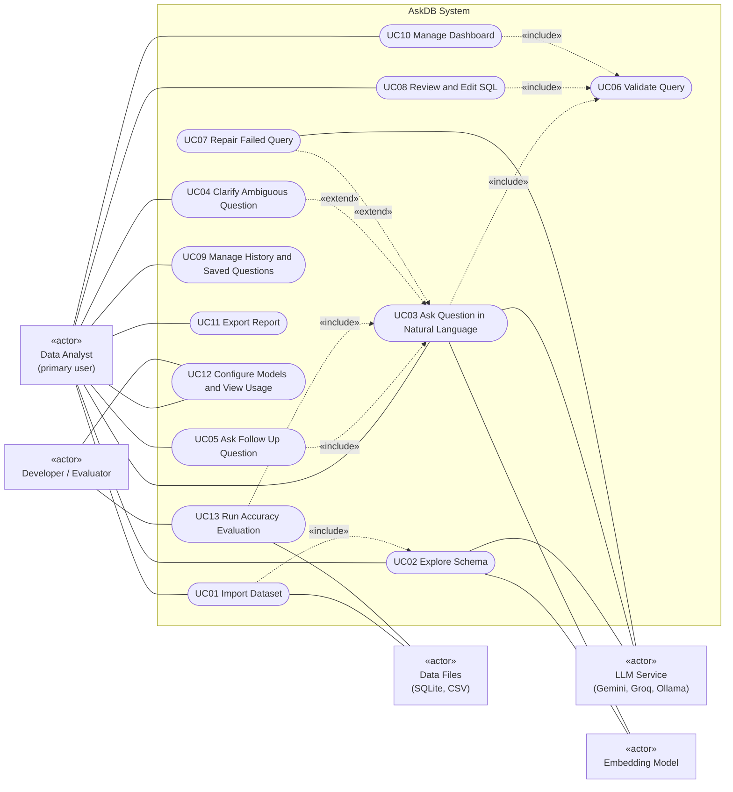

The rounded nodes inside the system boundary are the UML use cases. Solid lines are actor associations. Dashed arrows are «include» and «extend». Mermaid has no use-case oval, so this flowchart is the use-case diagram.

**Actors.** The **Data Analyst** is the primary user of all everyday features, including choosing a clarification (UC04). The **Developer / Evaluator** measures and tunes the agent (routing configuration and benchmark evaluation). The **LLM Service** (cloud APIs or the local Ollama server), the **Embedding Model**, and the **Data Files** are secondary actors outside the system boundary.

**Relationships.** Importing always builds the schema view and index (UC01 includes UC02). Every path that executes SQL includes UC06 Validate Query. Clarification (UC04) and repair (UC07) extend UC03 only when their conditions occur. Follow up questions and evaluation runs reuse the full question answering flow (include UC03).

**Feature coverage.** F01 → UC01; F02 → UC01, UC02; F03, F08, F09 → UC03; F04 → UC04; F10 → UC05; F05 → UC06; F06 → UC07; F07 → UC08; F11 → UC09; F12 → UC10; F13 → UC11; F14 → UC12; F15 → UC13.

# 6. Use Case Descriptions

## UC01 Import Dataset

| Field | Description |
|---|---|
| Use Case ID | UC01 |
| Use Case Name | Import Dataset |
| Actor(s) | Data Analyst (primary); Data Files, LLM Service, Embedding Model (secondary, through UC02) |
| Goal | Load a SQLite database or CSV files so questions can be asked about them. |
| Preconditions | AskDB is running. The files exist and are readable. |
| Trigger | The analyst chooses File, Import Dataset in the GUI or runs `askdb import`. |
| Main Success Scenario | 1. The analyst selects one SQLite file or one or more CSV files. 2. The system checks the file types and size. 3. The system creates the matching data source and connects in read only mode (CSV files are loaded into tables with inferred types). 4. The system reads tables, columns, keys, and row counts. 5. The system enriches the schema and builds the index (UC02). 6. The system creates a new session, clears conversation memory, and loads the dashboard for this dataset. 7. The system shows the schema and a confirmation with table and row counts. |
| Alternative/Exception Flows | 2a. Unsupported or mixed file types: the system lists supported types and stops. 2b. File larger than the configured limit (`max_import_mb`): the system stops with an error showing the file size and the limit, and the previous session remains active. 3a. Corrupt or locked SQLite file: an error is shown and the previous session remains active. 3b. CSV without a header or with bad rows: the system reports the file and line, or the number of skipped rows. 3c. Duplicate CSV names: a numeric suffix is added. 5a. LLM unavailable: the schema is shown without descriptions (see UC02). |
| Postconditions | An active session exists with a connected read only data source, schema, and schema index. |
| Related Feature(s) | F01, F02 |

## UC02 Explore Schema

| Field | Description |
|---|---|
| Use Case ID | UC02 |
| Use Case Name | Explore Schema |
| Actor(s) | Data Analyst (primary); LLM Service, Embedding Model (secondary) |
| Goal | Understand the structure and meaning of the data, and give the agent a searchable description of it. |
| Preconditions | A dataset has been imported. |
| Trigger | Automatically after import, or the analyst opens the Schema tab or runs `askdb schema`. |
| Main Success Scenario | 1. The system collects a few sample rows per table (if sample sharing is allowed). 2. The system asks the fast model for a one sentence description of each table and column. 3. The system stores the descriptions with the schema. 4. The system embeds every table and column entry into the schema index. 5. The analyst browses tables, columns, types, keys, row counts, descriptions, and sample rows. 6. Optionally, the analyst edits a description; the system updates that index entry. |
| Alternative/Exception Flows | 1a. Sample sharing disabled: descriptions are generated from names and types only. 2a. LLM unavailable: descriptions stay empty, the index uses names only, and a notice is shown. 3a. Unparseable model output: retried once, then that table is skipped. |
| Postconditions | The schema is annotated and the schema index is ready for retrieval. |
| Related Feature(s) | F02 |

## UC03 Ask Question in Natural Language

| Field | Description |
|---|---|
| Use Case ID | UC03 |
| Use Case Name | Ask Question in Natural Language |
| Actor(s) | Data Analyst (primary); LLM Service, Embedding Model (secondary) |
| Goal | Get a correct, explained answer to a question about the data without writing SQL. |
| Preconditions | A dataset is loaded. At least one model provider is available. |
| Trigger | The analyst types a question and presses Ask, or runs `askdb ask "..."`. |
| Main Success Scenario | 1. The analyst enters a question. 2. The system retrieves the most relevant tables and columns from the schema index. 3. The agent creates a plan and classifies the request as a normal query. 4. The agent chooses tools step by step (for example search schema, check column values, run query). 5. Every query is validated (UC06) and executed, and the result is returned to the agent. 6. The agent gives a final answer after a successful query. 7. The system chooses and builds a chart. 8. The agent writes a short summary and the system verifies every number in it against the result. 9. The system stores the turn in memory and the answer in history. 10. The system displays the summary, SQL, table, chart, and trace. |
| Alternative/Exception Flows | 1a. No dataset loaded: the analyst is asked to import one. 3a. Request to change data: the agent refuses and explains that AskDB is read only (status Refused). 3b. The data cannot answer the question: the agent explains why (status No Data). 3c. The question is ambiguous: UC04. 5a. A query fails or returns a suspicious empty result: UC07. 5b. A query is rejected by the safety guard: the agent is told only read queries are allowed and must rewrite it. 6a. The agent tries to answer before any query succeeded: the system rejects the final answer and the loop continues. 6b. Step limit reached: status Failed with the partial trace. 8a. A number cannot be verified: the summary is regenerated once, then flagged with a warning. Any step: the model provider fails, and the router falls back to another provider (UC12). |
| Postconditions | An answer with a status is displayed and recorded in history, and memory holds the new turn. The data is unchanged. |
| Related Feature(s) | F03, F05, F08, F09 |

## UC04 Clarify Ambiguous Question

| Field | Description |
|---|---|
| Use Case ID | UC04 |
| Use Case Name | Clarify Ambiguous Question |
| Actor(s) | Data Analyst (primary); LLM Service (secondary) |
| Goal | Resolve a question with several reasonable meanings before answering it. |
| Preconditions | UC03 is in progress in an interactive session. The plan or a step identified an ambiguity. |
| Trigger | The planner marks the plan as ambiguous, or the agent calls the ask user tool. |
| Main Success Scenario | 1. The system pauses the agent and saves its state. 2. The system shows the clarification prompt with two to four options. 3. The analyst picks an option or types an answer. 4. The system resumes the agent with the clarified meaning. 5. UC03 continues, and the final answer states the interpretation used. |
| Alternative/Exception Flows | 3a. The analyst asks a different question instead: the paused state is discarded. 4a. The answer is still ambiguous: after two rounds the agent chooses the most common interpretation and states it. 1a. Non interactive session (single CLI command or evaluation): the agent does not pause and must state its assumption. |
| Postconditions | The question is answered under an explicit interpretation. |
| Related Feature(s) | F04 |

## UC05 Ask Follow Up Question

| Field | Description |
|---|---|
| Use Case ID | UC05 |
| Use Case Name | Ask Follow Up Question |
| Actor(s) | Data Analyst (primary); LLM Service (secondary) |
| Goal | Refine or extend a previous answer without repeating the full question. |
| Preconditions | At least one answered turn exists in the current conversation. |
| Trigger | The analyst types a follow up such as "now only for 2024" in the same conversation or in `askdb shell`. |
| Main Success Scenario | 1. The analyst enters a follow up question. 2. The system adds recent turns (questions, SQL, result summaries) to the planning context. 3. The agent resolves references such as "that" or "those" to the previous query. 4. UC03 continues with the modified query. 5. The new turn is added to memory. |
| Alternative/Exception Flows | 2a. No previous turn exists: the agent asks what the reference means (UC04). 2b. Memory is full: the oldest turn is dropped. 3a. The question is unrelated: it is treated as a new question. The analyst presses New Conversation: memory is cleared. |
| Postconditions | The answer reflects both the new request and the earlier context. |
| Related Feature(s) | F10 |

## UC06 Validate Query

| Field | Description |
|---|---|
| Use Case ID | UC06 |
| Use Case Name | Validate Query |
| Actor(s) | Included use case; triggered on behalf of the Data Analyst or the agent. |
| Goal | Guarantee that only a single, read only, bounded query ever reaches the database. |
| Preconditions | SQL text is about to be executed. |
| Trigger | Any request to run SQL (agent tool call, manual SQL, rerun, dashboard refresh). |
| Main Success Scenario | 1. The system checks that the text is exactly one parseable statement. 2. The system checks that it only reads data. 3. The system checks that no forbidden command or system table is used. 4. The system adds or tightens a row limit. 5. The validated SQL is executed with a timeout. |
| Alternative/Exception Flows | 1a to 3a. A check fails: execution is blocked and a human readable reason is returned to the caller (the agent or the analyst). 5a. The timeout expires: the query is cancelled and reported as an error. |
| Postconditions | Either a bounded result was produced or nothing was executed. The data is never modified. |
| Related Feature(s) | F05 |

## UC07 Repair Failed Query

| Field | Description |
|---|---|
| Use Case ID | UC07 |
| Use Case Name | Repair Failed Query |
| Actor(s) | LLM Service (secondary); runs on behalf of the Data Analyst |
| Goal | Recover automatically from a failing or suspicious query. |
| Preconditions | In UC03, a query failed, was rejected, or returned an unexpected empty result. |
| Trigger | The run query tool returns an error or an empty result. |
| Main Success Scenario | 1. The system records the failure and increases the repair count. 2. The system builds a repair prompt with the SQL and the error. 3. The router selects a model for this attempt (the strong model from the second attempt under Cheap First). 4. The agent inspects the schema or column values if needed and proposes new SQL. 5. The new SQL is validated and executed. 6. UC03 continues with the successful result. |
| Alternative/Exception Flows | 4a. The agent repeats a SQL statement that already failed: the system stops with status Failed. 5a. Three repair attempts fail: status Failed, with the last error and a suggestion to edit the SQL (UC08). 4b. The empty result is genuine: after confirming the filter values, the agent reports that no rows match. |
| Postconditions | A working query and result exist, or the failure is clearly explained. |
| Related Feature(s) | F06 |

## UC08 Review and Edit SQL

| Field | Description |
|---|---|
| Use Case ID | UC08 |
| Use Case Name | Review and Edit SQL |
| Actor(s) | Data Analyst |
| Goal | Inspect and change the SQL behind an answer and run it directly. |
| Preconditions | A dataset is loaded. |
| Trigger | The analyst edits the SQL panel and presses Run, or runs `askdb sql "..."`. |
| Main Success Scenario | 1. The analyst edits or types SQL. 2. The system validates it (UC06). 3. The system executes it. 4. The system builds a chart. 5. The system records the entry in history as manual. 6. The system displays the result and chart. |
| Alternative/Exception Flows | 2a. Rejected by validation: the reason is shown and the text stays in the editor. 3a. SQLite error: the message is shown. |
| Postconditions | The result is displayed and recorded, and no LLM was called. |
| Related Feature(s) | F07, F05 |

## UC09 Manage History and Saved Questions

| Field | Description |
|---|---|
| Use Case ID | UC09 |
| Use Case Name | Manage History and Saved Questions |
| Actor(s) | Data Analyst |
| Goal | Find, reuse, and name previous questions. |
| Preconditions | The application database is available. |
| Trigger | The analyst opens the History tab, or runs `askdb history`, `askdb save`, or `askdb rerun`. |
| Main Success Scenario | 1. The system lists recent history entries. 2. The analyst searches by text. 3. The analyst saves an entry under a name. 4. The analyst reruns an entry; the system validates and executes its stored SQL and displays the result. |
| Alternative/Exception Flows | 3a. The name already exists: the analyst is asked to choose another. 4a. The stored SQL refers to a missing table: an error is shown with the option to ask the agent again with the original question. The application database is damaged: it is recreated and the old file is kept as a backup. |
| Postconditions | History and saved questions are updated; reruns produce new history entries. |
| Related Feature(s) | F11 |

## UC10 Manage Dashboard

| Field | Description |
|---|---|
| Use Case ID | UC10 |
| Use Case Name | Manage Dashboard |
| Actor(s) | Data Analyst |
| Goal | Keep important charts together and refresh them on demand. |
| Preconditions | A dataset is loaded. At least one answer exists to pin. |
| Trigger | The analyst presses Pin or Refresh, or runs `askdb pin` or `askdb dashboard --refresh`. |
| Main Success Scenario | 1. The analyst pins an answer. 2. The system creates a tile from the history entry and adds it to the dashboard. 3. The dashboard notifies its views, which redraw. 4. The system saves the dashboard. 5. Later, the analyst presses Refresh. 6. The system validates (UC06) and runs each tile query, then notifies the views. |
| Alternative/Exception Flows | 2a. The dashboard already has 12 tiles: the analyst is asked to remove one. 6a. A tile query fails: that tile shows an error while the others refresh normally. |
| Postconditions | The dashboard is persisted and shows current results. |
| Related Feature(s) | F12 |

## UC11 Export Report

| Field | Description |
|---|---|
| Use Case ID | UC11 |
| Use Case Name | Export Report |
| Actor(s) | Data Analyst |
| Goal | Produce a shareable report of selected answers. |
| Preconditions | At least one answer exists in history. |
| Trigger | The analyst presses Export or runs `askdb export`. |
| Main Success Scenario | 1. The analyst selects answers, a format (Markdown, HTML, or PDF), and a location. 2. The system collects the entries into report data. 3. The system creates the exporter for the format. 4. The exporter writes the header, one section per answer with its chart, and the footer. 5. The system saves the file and shows its path. |
| Alternative/Exception Flows | 1a. Nothing selected: the analyst is asked to select at least one answer. 3a. Unsupported format: supported formats are listed. 5a. Location not writable: the analyst chooses another location. 3b. PDF support unavailable: the report is produced as HTML with a notice. |
| Postconditions | A report file exists at the chosen location. |
| Related Feature(s) | F13 |

## UC12 Configure Models and View Usage

| Field | Description |
|---|---|
| Use Case ID | UC12 |
| Use Case Name | Configure Models and View Usage |
| Actor(s) | Data Analyst or Developer / Evaluator (primary); LLM Service (secondary) |
| Goal | Control which free models are used and see how much of each free quota the requests consume. |
| Preconditions | AskDB is running. |
| Trigger | The user changes the routing policy in Settings or runs `askdb config --policy`; the user opens the Usage and Trace tab or runs `askdb usage`. |
| Main Success Scenario | 1. The user selects Cheap First, Strong Only, or Local Only. 2. The system creates any missing providers and activates the policy. 3. During later requests, the router selects a provider for each call according to the policy. 4. Each agent step is published as an event and recorded. 5. The user views the step by step trace and session totals of tokens, latency, and estimated cost. |
| Alternative/Exception Flows | 2a. A required API key is missing: the policy is unavailable and setup instructions are shown. 2b. Ollama is not running for Local Only: a clear message is shown. 3a. The selected provider times out or is rate limited: the router tries the next available provider and records a fallback event (never to a cloud provider under Local Only). |
| Postconditions | The chosen policy is active and usage data is up to date. |
| Related Feature(s) | F14 |

## UC13 Run Accuracy Evaluation

| Field | Description |
|---|---|
| Use Case ID | UC13 |
| Use Case Name | Run Accuracy Evaluation |
| Actor(s) | Developer / Evaluator (primary); LLM Service, Data Files (secondary) |
| Goal | Measure how often the agent produces correct results, and compare configurations. |
| Preconditions | A benchmark file and its databases exist. A model provider is available. |
| Trigger | The evaluator runs `askdb eval` or starts a run in the Evaluation tab. |
| Main Success Scenario | 1. The evaluator selects a benchmark and a routing policy. 2. The system validates and loads the benchmark. 3. For each case, the system creates a fresh non interactive session and asks the question through UC03. 4. The system runs the gold SQL. 5. The system compares the two results. 6. The system records correctness, latency, and cost. 7. The system shows and saves the evaluation report (accuracy, abstentions, invalid cases, average latency, total cost, failures). |
| Alternative/Exception Flows | 2a. Malformed benchmark: errors are listed by case ID. 4a. Gold SQL fails: the case is marked invalid and excluded. 3a. The agent refuses, finds no data, or needs clarification: counted as an abstention. The run is interrupted: a partial report is saved. |
| Postconditions | An evaluation report exists; the previous routing policy is restored. |
| Related Feature(s) | F15 |

# 7. Sequence Diagrams

Nine sequence diagrams cover every important behavior. All participants and messages use the classes and methods from the class diagram. Where the CLI triggers the same behavior as the GUI, `CliApp` calls the same `AskDBFacade` method and everything from the facade onward is identical; SD09 shows a CLI initiated flow explicitly.

| Diagram | Behavior | Features | Use cases |
|---|---|---|---|
| SD01 | Import dataset and build schema index | F01, F02 | UC01, UC02 |
| SD02 | Answer a natural language question | F03, F08, F09 | UC03 |
| SD03 | Refusal, safety validation, and query repair | F05, F06 | UC06, UC07 |
| SD04 | Clarification and follow up question | F04, F10 | UC04, UC05 |
| SD05 | Run manually edited SQL | F07, F05, F08 | UC08, UC06 |
| SD06 | History, saved questions, and dashboard | F11, F12 | UC09, UC10 |
| SD07 | Export report | F13 | UC11 |
| SD08 | Model routing, fallback, and usage monitoring | F14 | UC12 |
| SD09 | Accuracy evaluation from the CLI | F15 | UC13 |

The CLI starts the same facade call as the GUI. The `CliApp` method for each diagram is: SD01 `import_cmd` (schema browse after import: `schema_cmd`); SD02 `ask_cmd`; SD03 `ask_cmd`; SD04 `shell_cmd`; SD05 `sql_cmd`; SD06 `history_cmd`, `save_cmd`, `rerun_cmd`, `pin_cmd`, and `dashboard_cmd`; SD07 `export_cmd`; SD08 `config_cmd` and `usage_cmd`; SD09 `eval_cmd`.

## SD01 Import Dataset and Build Schema Index

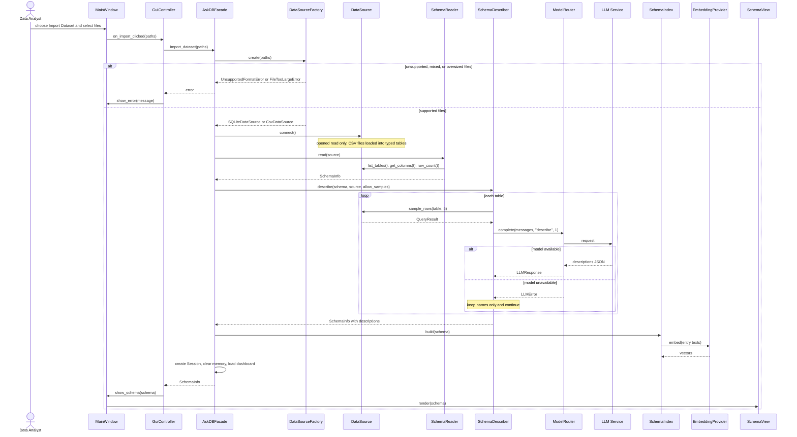

## SD02 Answer a Natural Language Question

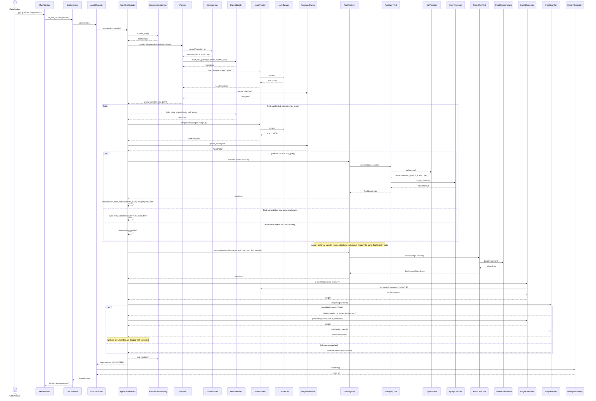

## SD03 Refusal, Safety Validation, and Query Repair

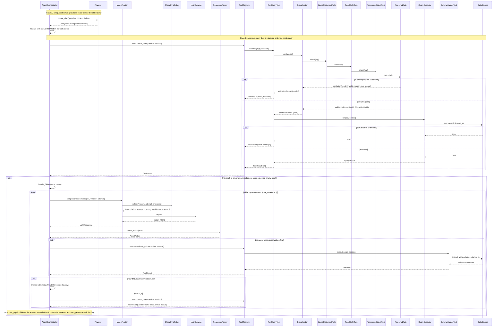

The rejection arrow is drawn from the last rule for readability; in the implementation, whichever rule rejects stops the chain and its `ValidationResult` travels back to `SqlValidator`.

## SD04 Clarification and Follow Up Question

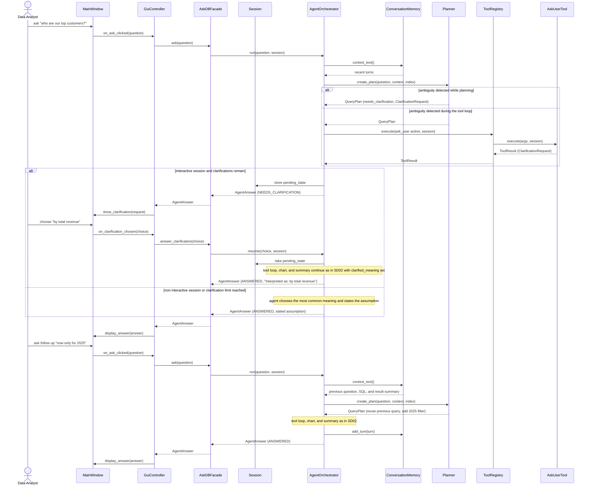

## SD05 Run Manually Edited SQL

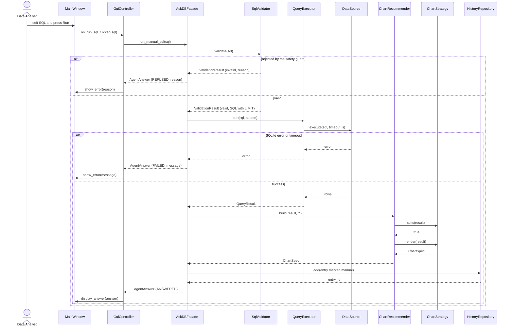

No LLM participates in this diagram: manual SQL is fully deterministic.

## SD06 History, Saved Questions, and Dashboard

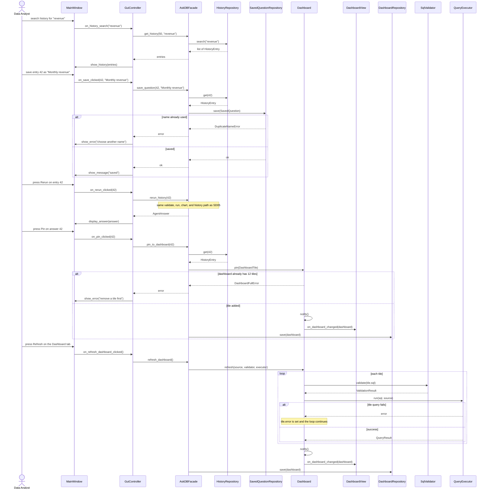

## SD07 Export Report

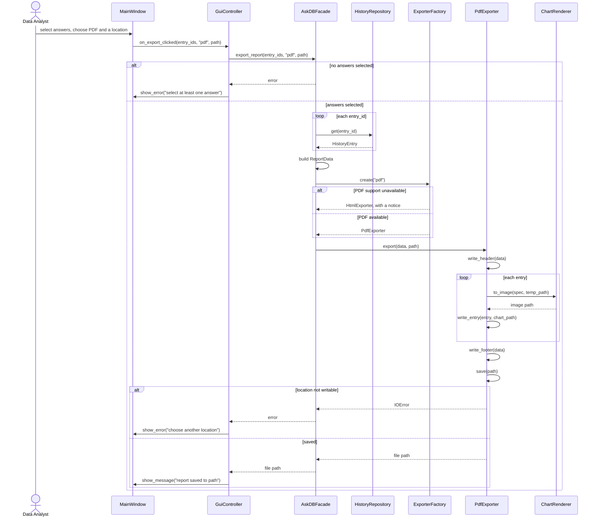

## SD08 Model Routing, Fallback, and Usage Monitoring

```mermaid
sequenceDiagram
    actor A as Data Analyst
    participant MW as MainWindow
    participant GC as GuiController
    participant F as AskDBFacade
    participant PF as LLMProviderFactory
    participant MR as ModelRouter
    participant POL as RoutingPolicy
    participant FAST as GeminiAdapter (fast tier)
    participant NEXT as Next available LLMProvider
    participant O as AgentOrchestrator
    participant TV as TraceView
    participant UT as UsageTracker

    A->>MW: choose Cheap First in Settings
    MW->>GC: on_policy_changed("cheap_first")
    GC->>F: set_routing_policy("cheap_first")
    F->>PF: create(provider_name) for each missing provider
    alt API key missing
        PF-->>F: provider not available
        F-->>GC: error with setup instructions
        GC->>MW: show_error(message)
    else providers ready
        PF-->>F: LLMProvider objects
        F->>MR: add_provider(provider)
        F->>MR: set_policy(CheapFirstPolicy)
        F-->>GC: ok
        GC->>MW: show_message("policy updated")
    end

    Note over O,MR: later, during any agent request
    O->>MR: complete(messages, "step", 1)
    MR->>POL: select("step", 1, providers)
    POL-->>MR: fast provider
    MR->>FAST: complete(messages, max_tokens)
    alt timeout or rate limit
        FAST-->>MR: LLMError
        MR->>MR: fallback(failed, messages)
        Note over MR: rate limits (429) are first retried with backoff 2s, 4s, 8s; under Local Only the router never falls back to a cloud provider
        MR->>O: event_sink(AgentEvent fallback)
        MR->>NEXT: complete(messages, max_tokens)
        NEXT-->>MR: LLMResponse
        MR->>O: event_sink(AgentEvent llm_call)
        MR-->>O: LLMResponse (fallback used)
    else success
        FAST-->>MR: LLMResponse
        MR->>O: event_sink(AgentEvent llm_call)
        MR-->>O: LLMResponse (tokens, latency, cost)
    end
    O->>O: notify(event)
    O->>TV: on_event(event)
    O->>UT: on_event(event)

    A->>MW: open the Usage and Trace tab
    MW->>GC: on_usage_tab_opened()
    GC->>F: get_usage_summary()
    F->>UT: summary()
    UT-->>F: UsageSummary
    F-->>GC: UsageSummary
    GC->>MW: show_usage(summary)
```

## SD09 Accuracy Evaluation from the CLI

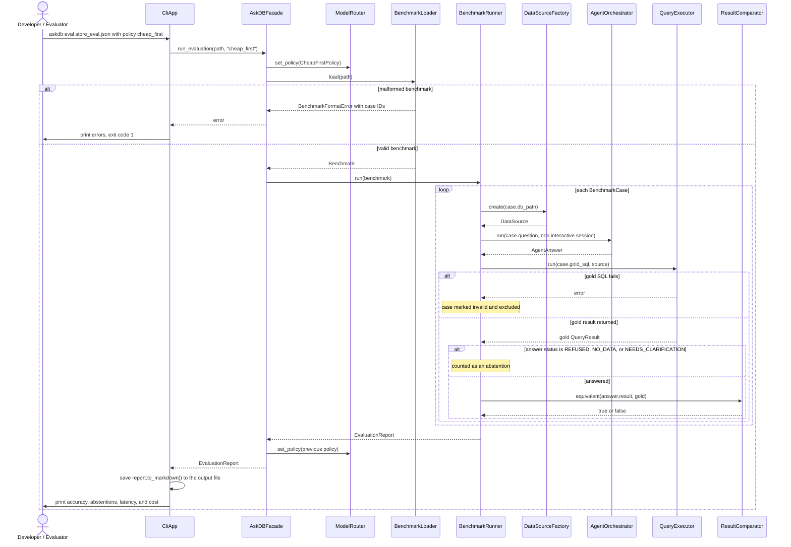

In the GUI, the Evaluation tab triggers the same flow through `GuiController.on_evaluate_clicked()` and shows the result with `EvaluationView.show_report()`.

# 8. Feature to Design Traceability Table

| Feature | Description | Type | Related Use Case | Classes | Key Methods | Sequence Diagram | Design Pattern(s) |
|---|---|---|---|---|---|---|---|
| F01 Dataset Import | Load SQLite or CSV data into a read only session | Deterministic | UC01 Import Dataset | MainWindow, GuiController, AskDBFacade, DataSourceFactory, SQLiteDataSource, CsvDataSource, TypeInferrer, SchemaReader, Session | `on_import_clicked()`, `import_dataset()`, `create()`, `connect()`, `read()` | SD01 | Facade, Factory Method, Adapter |
| F02 Schema Explorer | Annotated schema view and semantic schema index | Hybrid | UC01, UC02 Explore Schema | SchemaDescriber, PromptBuilder, ModelRouter, ResponseParser, SchemaIndex, LocalEmbeddingProvider, SchemaView | `describe()`, `build_description_prompt()`, `complete()`, `parse_descriptions()`, `build()`, `embed()`, `update_entry()`, `render()` | SD01 | Adapter, Strategy, MVC |
| F03 Natural Language Question Answering | Agent plans, uses tools, and answers a question | AI | UC03 Ask Question | AskDBFacade, AgentOrchestrator, Planner, SchemaIndex, PromptBuilder, ModelRouter, LLMProvider, ResponseParser, ToolRegistry, SearchSchemaTool, SampleRowsTool, RunQueryTool, QueryExecutor | `ask()`, `run()`, `create_plan()`, `search()`, `build_step_prompt()`, `complete()`, `parse_action()`, `execute()`, `finalize()` | SD02 | Facade, Command, Strategy, Adapter, Observer |
| F04 Ambiguity Clarification | Ask the user when a question has several meanings | AI | UC04 Clarify Ambiguous Question | AgentOrchestrator, Planner, AskUserTool, Session, ClarificationRequest, MainWindow, GuiController | `create_plan()`, `execute()`, `show_clarification()`, `on_clarification_chosen()`, `answer_clarification()`, `resume()` | SD04 | Command, Facade |
| F05 Query Safety Guard | Allow only single, read only, bounded queries | Deterministic | UC06 Validate Query | SqlValidator, SqlRule, SingleStatementRule, ReadOnlyRule, ForbiddenObjectRule, RowLimitRule, RunQueryTool, QueryExecutor, SQLiteDataSource | `validate()`, `check()`, `evaluate()`, `run()` | SD03, SD05 | Chain of Responsibility, Command |
| F06 Self Correcting Query Repair | Recover from failing or suspicious queries | Hybrid | UC07 Repair Failed Query | AgentOrchestrator, PromptBuilder, ModelRouter, CheapFirstPolicy, ResponseParser, ColumnValuesTool, RunQueryTool | `handle_failure()`, `build_repair_prompt()`, `complete()`, `select()`, `distinct_values()`, `execute()` | SD03 | Strategy, Command |
| F07 SQL Review and Manual Editing | Run user edited SQL without the LLM | Deterministic | UC08 Review and Edit SQL | QueryPanel, GuiController, AskDBFacade, SqlValidator, QueryExecutor, ChartRecommender, HistoryRepository | `on_run_sql_clicked()`, `run_manual_sql()`, `validate()`, `run()`, `build()`, `add()` | SD05 | Facade, Chain of Responsibility, MVC |
| F08 Automatic Chart Generation | Pick and build a suitable chart | Hybrid | UC03 | MakeChartTool, ChartRecommender, ChartStrategy, BarChartStrategy, LineChartStrategy, PieChartStrategy, ScatterChartStrategy, TableOnlyStrategy, ChartSpec, ChartView, ChartRenderer, AskDBFacade | `execute()`, `build()`, `recommend()`, `suits()`, `render()`, `to_image()`, `build_chart()` | SD02, SD05 | Strategy, Command |
| F09 Grounded Insight Summary | Summary whose numbers are verified against the result | Hybrid | UC03 | InsightGenerator, PromptBuilder, ModelRouter, ResponseParser, InsightVerifier, Insight, VerificationReport | `generate()`, `build_insight_prompt()`, `complete()`, `parse_insight()`, `verify()` | SD02 | Strategy (model routing) |
| F10 Follow Up Conversation Memory | Refine answers using recent turns | AI | UC05 Ask Follow Up Question | ConversationMemory, Turn, AgentOrchestrator, Planner, AskDBFacade | `context_text()`, `create_plan()`, `add_turn()`, `reset_conversation()`, `clear()` | SD04 | Facade |
| F11 Query History and Saved Questions | Search, rerun, and name past questions | Deterministic | UC09 Manage History and Saved Questions | AskDBFacade, HistoryRepository, SavedQuestionRepository, AppDatabase, HistoryEntry, SavedQuestion | `get_history()`, `search()`, `save_question()`, `save()`, `rerun_history()`, `get()` | SD06 | Repository, Facade |
| F12 Dashboard of Pinned Charts | Pin charts and refresh them together | Deterministic | UC10 Manage Dashboard | Dashboard, DashboardTile, DashboardObserver, DashboardView, DashboardRepository, SqlValidator, QueryExecutor | `pin_to_dashboard()`, `pin()`, `unpin_from_dashboard()`, `unpin()`, `notify()`, `on_dashboard_changed()`, `refresh()`, `save()` | SD06 | Observer, Repository |
| F13 Report Export | Markdown, HTML, or PDF report of answers | Deterministic | UC11 Export Report | AskDBFacade, ExporterFactory, ReportExporter, MarkdownExporter, HtmlExporter, PdfExporter, ReportData, ChartRenderer, HistoryRepository | `export_report()`, `create()`, `export()`, `write_header()`, `write_entry()`, `write_footer()`, `save()`, `to_image()` | SD07 | Template Method, Factory Method |
| F14 Model Routing and Usage Monitor | Choose models per call, fall back, and track usage | Hybrid | UC12 Configure Models and View Usage | ModelRouter, RoutingPolicy, CheapFirstPolicy, StrongOnlyPolicy, LocalOnlyPolicy, LLMProviderFactory, GeminiAdapter, GroqAdapter, OllamaAdapter, AgentEvent, UsageTracker, TraceView | `set_routing_policy()`, `create()`, `set_policy()`, `select()`, `complete()`, `fallback()`, `on_event()`, `summary()` | SD08 | Strategy, Adapter, Factory Method, Observer |
| F15 Accuracy Evaluation | Score the agent against gold SQL | Hybrid | UC13 Run Accuracy Evaluation | CliApp, EvaluationView, AskDBFacade, BenchmarkLoader, BenchmarkRunner, DataSourceFactory, AgentOrchestrator, QueryExecutor, ResultComparator, EvaluationReport | `eval_cmd()`, `run_evaluation()`, `load()`, `run()`, `equivalent()`, `to_markdown()` | SD09 | Facade, Factory Method |

# 9. Feature Implementation Explanations

## F01 Dataset Import

**Related Use Case:** UC01 Import Dataset · **Related Sequence Diagram:** SD01

**Classes involved:**
* `MainWindow` and `GuiController` collect the selected files; `CliApp` does the same for `askdb import`.
* `AskDBFacade` coordinates the import and creates the new `Session`.
* `DataSourceFactory` decides which data source to create from the file extension.
* `SQLiteDataSource` opens a database file read only; `CsvDataSource` (with `TypeInferrer`) loads CSV files into typed tables.
* `SchemaReader` produces the `SchemaInfo` model.

**Important methods:** `GuiController.on_import_clicked()`, `AskDBFacade.import_dataset()`, `DataSourceFactory.create()`, `DataSource.connect()`, `SchemaReader.read()`.

**Execution:** When the analyst selects files, `on_import_clicked()` passes the paths to `import_dataset()`. The facade asks `DataSourceFactory.create()` for the right `DataSource` and calls `connect()`. `SchemaReader.read()` lists tables and columns and returns `SchemaInfo`. After enrichment (F02), the facade creates a `Session` holding the source, schema, index, and an empty memory, then returns the schema to the GUI.

## F02 Schema Explorer with Semantic Descriptions

**Related Use Cases:** UC01, UC02 Explore Schema · **Related Sequence Diagram:** SD01

**Classes involved:**
* `SchemaDescriber` gathers sample rows and requests descriptions.
* `PromptBuilder`, `ModelRouter`, and `ResponseParser` build the prompt, send it to the fast tier, and parse the JSON reply.
* `SchemaIndex` with `LocalEmbeddingProvider` embeds table and column entries for semantic search.
* `SchemaView` displays the annotated schema.

**Important methods:** `SchemaDescriber.describe()`, `PromptBuilder.build_description_prompt()`, `ModelRouter.complete()`, `ResponseParser.parse_descriptions()`, `SchemaIndex.build()`, `SchemaIndex.update_entry()`, `SchemaView.render()`.

**Execution:** During import, the facade calls `describe()`. For each table it fetches a few sample rows (only if sharing is allowed), builds a description prompt, and calls `complete()` with the task `"describe"`, which the routing policy sends to the fast model. Parsed descriptions are stored in `ColumnInfo` and `TableInfo`. `SchemaIndex.build()` embeds every entry. When the analyst edits a description, `AskDBFacade.update_description()` saves it and calls `update_entry()` for that entry only.

## F03 Natural Language Question Answering

**Related Use Case:** UC03 Ask Question in Natural Language · **Related Sequence Diagram:** SD02

**Classes involved:**
* `GuiController` / `CliApp` pass the question to `AskDBFacade`.
* `AgentOrchestrator` runs the plan, act, observe loop and enforces limits.
* `Planner` retrieves schema hits from `SchemaIndex` and produces a `QueryPlan`.
* `PromptBuilder`, `ModelRouter`, `LLMProvider`, and `ResponseParser` handle every model call.
* `ToolRegistry` and the tools (`SearchSchemaTool`, `SampleRowsTool`, `ColumnValuesTool`, `RunQueryTool`) perform the actions.
* `QueryExecutor` runs validated SQL.

**Important methods:** `AskDBFacade.ask()`, `AgentOrchestrator.run()`, `Planner.create_plan()`, `SchemaIndex.search()`, `PromptBuilder.build_step_prompt()`, `ModelRouter.complete()`, `ResponseParser.parse_action()`, `ToolRegistry.execute()`, `AgentOrchestrator.finalize()`.

**Execution:** `ask()` calls `run()`. The orchestrator gets conversation context and asks `Planner.create_plan()`, which searches the schema index and asks the model for a plan. In the loop, the orchestrator builds a step prompt listing the tool specifications, gets an `AgentAction`, and executes it through `ToolRegistry`. Results become observations for the next step. A final answer is accepted only after a successful query. `finalize()` then builds the chart (F08) and the verified summary (F09), stores the turn in memory, and returns an `AgentAnswer`, which the facade records in history and the GUI displays.

## F04 Ambiguity Clarification

**Related Use Case:** UC04 Clarify Ambiguous Question · **Related Sequence Diagram:** SD04

**Classes involved:**
* `Planner` flags ambiguity in the `QueryPlan`, or the model calls `AskUserTool` during the loop.
* `AgentOrchestrator` pauses and stores its `AgentState` in `Session.pending_state`.
* `MainWindow` shows the `ClarificationRequest`; `GuiController` returns the choice.
* `AskDBFacade.answer_clarification()` resumes the agent.

**Important methods:** `Planner.create_plan()`, `AskUserTool.execute()`, `MainWindow.show_clarification()`, `GuiController.on_clarification_chosen()`, `AskDBFacade.answer_clarification()`, `AgentOrchestrator.resume()`.

**Execution:** When the plan has `needs_clarification` set, or `AskUserTool` returns a `ClarificationRequest`, the orchestrator saves its state and returns an answer with status `NEEDS_CLARIFICATION`. The GUI shows the options. The analyst's choice goes through `answer_clarification()` to `resume()`, which restores the state, records the clarified meaning, and continues the loop. In non interactive sessions, or after two rounds, the orchestrator tells the model to choose the most common meaning and state it.

## F05 Query Safety Guard

**Related Use Case:** UC06 Validate Query · **Related Sequence Diagrams:** SD03, SD05

**Classes involved:**
* `SqlValidator` builds and owns the rule chain.
* `SingleStatementRule`, `ReadOnlyRule`, `ForbiddenObjectRule`, and `RowLimitRule` each enforce one guarantee.
* `RunQueryTool`, `AskDBFacade`, and `Dashboard` call the validator before any execution.
* `QueryExecutor` applies the timeout; `SQLiteDataSource` is opened read only as a second layer.

**Important methods:** `SqlValidator.validate()`, `SqlRule.check()`, `SqlRule.evaluate()`, `QueryExecutor.run()`.

**Execution:** Every caller passes SQL to `validate()`, which sends it to the head of the chain. Each rule's `check()` calls its own `evaluate()`; a failure stops the chain with a reason, and success passes the SQL (possibly rewritten with a `LIMIT`) to the next rule. Only a fully valid statement reaches `QueryExecutor.run()`. Requests that are clearly destructive are caught even earlier, when the planner classifies them as `destructive` and the orchestrator refuses without calling tools.

## F06 Self Correcting Query Repair

**Related Use Case:** UC07 Repair Failed Query · **Related Sequence Diagram:** SD03

**Classes involved:**
* `AgentOrchestrator` detects failures, counts repairs, and detects repeated SQL.
* `PromptBuilder` builds the repair prompt with the failed SQL and error.
* `ModelRouter` with `CheapFirstPolicy` escalates to the strong model from the second attempt.
* `ColumnValuesTool` lets the agent check real values before fixing filters.
* `RunQueryTool` validates and executes each new attempt.

**Important methods:** `AgentOrchestrator.handle_failure()`, `PromptBuilder.build_repair_prompt()`, `ModelRouter.complete()`, `RoutingPolicy.select()`, `DataSource.distinct_values()`, `ToolRegistry.execute()`.

**Execution:** When `RunQueryTool` returns an error, a rejection, or an unexpected empty result, `handle_failure()` increases `repair_count`. The next model call uses the repair prompt and passes the attempt number to `complete()`, so the policy can choose a stronger model. The agent may call `column_values` to check the actual stored values, then proposes new SQL. If that SQL appears in `seen_sql`, or `max_repairs` is exceeded, the orchestrator finishes with status `FAILED` and a clear explanation.

## F07 SQL Review and Manual Editing

**Related Use Case:** UC08 Review and Edit SQL · **Related Sequence Diagram:** SD05

**Classes involved:**
* `QueryPanel` holds the editable SQL; `GuiController` forwards Run; `CliApp.sql_cmd()` does the same from the terminal.
* `AskDBFacade` runs the deterministic path.
* `SqlValidator`, `QueryExecutor`, `ChartRecommender`, and `HistoryRepository` validate, execute, chart, and record.

**Important methods:** `GuiController.on_run_sql_clicked()`, `AskDBFacade.run_manual_sql()`, `SqlValidator.validate()`, `QueryExecutor.run()`, `ChartRecommender.build()`, `HistoryRepository.add()`.

**Execution:** `run_manual_sql()` validates the SQL, runs it, builds a chart for the result, and stores a history entry marked manual. The result is returned as an `AgentAnswer` so the GUI can display it exactly like an agent answer. No model is called.

## F08 Automatic Chart Generation

**Related Use Case:** UC03 · **Related Sequence Diagrams:** SD02, SD05

**Classes involved:**
* `MakeChartTool` is invoked by the orchestrator (with the plan's chart hint) or by the model.
* `ChartRecommender` chooses a strategy.
* `BarChartStrategy`, `LineChartStrategy`, `PieChartStrategy`, `ScatterChartStrategy`, and `TableOnlyStrategy` decide suitability and build a `ChartSpec`.
* `ChartView` displays it; `ChartRenderer` produces images for the CLI and reports.

**Important methods:** `MakeChartTool.execute()`, `ChartRecommender.build()`, `ChartRecommender.recommend()`, `ChartStrategy.suits()`, `ChartStrategy.render()`, `ChartRenderer.to_image()`.

**Execution:** During `finalize()`, the orchestrator executes `make_chart` with the hint from the plan. `ChartRecommender` uses the hinted strategy if `suits()` returns true, otherwise the first suitable strategy. The selected strategy's `render()` returns a `ChartSpec`, which travels in the `AgentAnswer` to `ChartView`. When the analyst changes the chart type, `GuiController.on_chart_type_changed()` calls `AskDBFacade.build_chart(result, chart_type)`, which asks `ChartRecommender` for that strategy, so the GUI itself contains no charting logic.

## F09 Grounded Insight Summary

**Related Use Case:** UC03 · **Related Sequence Diagram:** SD02

**Classes involved:**
* `InsightGenerator` writes the summary through `PromptBuilder`, `ModelRouter`, and `ResponseParser`.
* `InsightVerifier` checks every number against the result.
* `Insight` and `VerificationReport` carry the text and its verification status.

**Important methods:** `InsightGenerator.generate()`, `PromptBuilder.build_insight_prompt()`, `ResponseParser.parse_insight()`, `InsightVerifier.verify()`.

**Execution:** After the chart is built, the orchestrator calls `generate()` with the question and result (at most 50 rows plus totals). For an empty result it returns a fixed message without calling the model. `verify()` extracts every number from the text and matches it against result cells, totals, and simple derived values within a rounding tolerance. If any number is unverified, the orchestrator calls `generate()` once more with that feedback, then flags anything still unverified.

## F10 Follow Up Conversation Memory

**Related Use Case:** UC05 Ask Follow Up Question · **Related Sequence Diagram:** SD04

**Classes involved:**
* `ConversationMemory` stores a bounded list of `Turn` objects in the `Session`.
* `AgentOrchestrator` reads and writes memory.
* `Planner` receives the context and resolves references.
* `AskDBFacade.reset_conversation()` clears it.

**Important methods:** `ConversationMemory.context_text()`, `Planner.create_plan()`, `ConversationMemory.add_turn()`, `AskDBFacade.reset_conversation()`, `ConversationMemory.clear()`.

**Execution:** At the start of every `run()`, the orchestrator calls `context_text()` and passes the recent questions, SQL, and result summaries to the planner, so "now only for 2025" is planned as a change to the previous query. After a successful answer, `add_turn()` stores the new turn and drops the oldest when the limit is reached. Importing a dataset or pressing New Conversation clears memory.

## F11 Query History and Saved Questions

**Related Use Case:** UC09 Manage History and Saved Questions · **Related Sequence Diagram:** SD06

**Classes involved:**
* `AskDBFacade` records and retrieves entries.
* `HistoryRepository` and `SavedQuestionRepository` persist `HistoryEntry` and `SavedQuestion` objects in `AppDatabase`.
* `MainWindow` shows history through `show_history()`.

**Important methods:** `AskDBFacade.get_history()`, `HistoryRepository.search()`, `AskDBFacade.save_question()`, `SavedQuestionRepository.save()`, `AskDBFacade.rerun_history()`, `HistoryRepository.get()`.

**Execution:** Every call to `ask()`, `answer_clarification()`, and `run_manual_sql()` ends with `HistoryRepository.add()`. The History tab calls `get_history()`, which uses `search()` when text is given. Saving copies the entry into a named `SavedQuestion`. Rerunning loads the entry and follows the manual SQL path (validate, run, chart, record) without calling the model.

## F12 Dashboard of Pinned Charts

**Related Use Case:** UC10 Manage Dashboard · **Related Sequence Diagram:** SD06

**Classes involved:**
* `Dashboard` (subject) holds up to 12 `DashboardTile` objects and notifies observers.
* `DashboardView` (observer) redraws when notified.
* `DashboardRepository` persists the dashboard per dataset.
* `SqlValidator` and `QueryExecutor` rerun tile queries.

**Important methods:** `AskDBFacade.pin_to_dashboard()`, `Dashboard.pin()`, `Dashboard.notify()`, `DashboardView.on_dashboard_changed()`, `Dashboard.refresh()`, `DashboardRepository.save()`.

**Execution:** Pinning loads the history entry, creates a tile with its SQL and chart type, and calls `pin()`. The dashboard notifies all observers, so the Dashboard tab updates without the facade knowing about the view, and the repository saves it. `refresh()` validates and runs every tile query, records errors per tile, and notifies observers once at the end.

## F13 Report Export

**Related Use Case:** UC11 Export Report · **Related Sequence Diagram:** SD07

**Classes involved:**
* `AskDBFacade` assembles `ReportData` from `HistoryRepository`.
* `ExporterFactory` creates the exporter for the chosen format.
* `ReportExporter` defines the template method; `MarkdownExporter`, `HtmlExporter`, and `PdfExporter` implement the steps.
* `ChartRenderer` produces chart images.

**Important methods:** `AskDBFacade.export_report()`, `ExporterFactory.create()`, `ReportExporter.export()`, `write_header()`, `write_entry()`, `write_footer()`, `save()`, `ChartRenderer.to_image()`.

**Execution:** `export_report()` loads the selected entries, builds `ReportData`, and asks the factory for an exporter. `export()` runs the fixed sequence: header, then for each entry a rendered chart image and `write_entry()`, then the footer and `save()`. The file path is returned and shown to the analyst.

## F14 Model Routing and Usage Monitor

**Related Use Case:** UC12 Configure Models and View Usage · **Related Sequence Diagram:** SD08

**Classes involved:**
* `LLMProviderFactory` creates provider adapters from configuration.
* `ModelRouter` (context) and `RoutingPolicy` implementations (strategies) choose the provider per call.
* `GeminiAdapter`, `GroqAdapter`, and `OllamaAdapter` call the actual services.
* `AgentOrchestrator` publishes an `AgentEvent` for every call; `TraceView` and `UsageTracker` observe them.

**Important methods:** `AskDBFacade.set_routing_policy()`, `LLMProviderFactory.create()`, `ModelRouter.set_policy()`, `RoutingPolicy.select()`, `ModelRouter.complete()`, `ModelRouter.fallback()`, `AgentEventListener.on_event()`, `UsageTracker.summary()`.

**Execution:** Choosing a policy calls `set_routing_policy()`, which creates any missing providers and installs the policy. On every model call, `complete()` asks the policy to `select()` a provider for the task and attempt, calls it, and on a timeout or rate limit uses `fallback()` to try the next available provider (never a cloud provider under Local Only). Each `LLMResponse` carries tokens, latency, and cost; the orchestrator publishes an event that `TraceView` and `UsageTracker` receive. The Usage tab calls `get_usage_summary()`.

## F15 Accuracy Evaluation

**Related Use Case:** UC13 Run Accuracy Evaluation · **Related Sequence Diagram:** SD09

**Classes involved:**
* `CliApp.eval_cmd()` and `EvaluationView` start the run and display the report.
* `BenchmarkLoader` reads and validates the benchmark.
* `BenchmarkRunner` runs each case through a fresh non interactive session.
* `DataSourceFactory`, `AgentOrchestrator`, and `QueryExecutor` produce the predicted and gold results.
* `ResultComparator` decides equivalence; `EvaluationReport` summarizes.

**Important methods:** `CliApp.eval_cmd()`, `AskDBFacade.run_evaluation()`, `BenchmarkLoader.load()`, `BenchmarkRunner.run()`, `ResultComparator.equivalent()`, `EvaluationReport.to_markdown()`.

**Execution:** `run_evaluation()` switches to the requested policy and loads the benchmark. `BenchmarkRunner.run()` creates a data source for each case, runs the agent without interaction, runs the gold SQL, and calls `equivalent()` (order sensitive only when the gold query orders its results, otherwise a multiset comparison with rounding). Refusals and clarifications count as abstentions and failing gold queries as invalid. The report is returned, the previous policy restored, and the CLI prints and saves it.

# 10. Design Principles and Key Decisions

## 10.1 Design principles

| Principle | Where it appears |
|---|---|
| Abstraction and interfaces | `LLMProvider`, `DataSource`, `Tool`, `RoutingPolicy`, `ChartStrategy`, `EmbeddingProvider`, `AgentEventListener`, and `DashboardObserver` define what a component does, not how. |
| Encapsulation | `Session` hides current state; `SqlValidator` hides its rule chain; repositories hide all application database SQL; adapters hide vendor SDKs. |
| Separation of concerns | Presentation, application, agent, LLM access, data and safety, and output are separate layers with one direction of dependency. |
| High cohesion | Each class has one job: `PromptBuilder` only builds prompts, `ResponseParser` only parses, `QueryExecutor` only executes, `InsightVerifier` only checks numbers. |
| Low coupling | The GUI and CLI know only `AskDBFacade`. The agent knows tools and providers only through interfaces. |
| Dependency inversion | High level classes (`AgentOrchestrator`, `Planner`, `ModelRouter`) depend on abstractions that are injected through their constructors, which is what allows `MockLLMProvider` in tests. |
| Polymorphism | Tools, rules, routing policies, chart strategies, exporters, and data sources are used through their common interface. |
| Open/closed | New tools, rules, policies, chart types, formats, and providers are added as new classes without modifying existing ones. |

## 10.2 Key design decisions

1. **The model proposes, the software decides.** The LLM only returns structured JSON. Parsing, argument validation, SQL validation, execution, and number verification are deterministic. This makes the system safe.
2. **Read only is enforced twice.** The validator only allows reads, and the connection itself is read only. A bug in one layer cannot modify data.
3. **Every loop is bounded.** Steps, repairs, and clarifications have limits, and repeated SQL is detected, so the agent always terminates with a clear status.
4. **Answers must be grounded.** A final answer requires a successful query, and every number in the summary is verified against the result.
5. **Only the relevant schema is sent to the model.** Semantic retrieval keeps prompts small for large databases, and only a few sample rows are ever shared, with a setting to share none.
6. **A private, offline mode exists.** Local Only routing keeps all data on the machine.
7. **Evaluation is part of the design.** A built in benchmark runner makes accuracy measurable, so design changes can be judged with numbers rather than impressions.
8. **Zero cost by design.** Every model is local or on a free tier with no credit card, every library is open source, and rate limits are handled by backoff and fallback rather than by paying for higher tiers. `AgentTrace.to_json()` exports each run so behavior can be tested and analyzed without any paid tooling.
9. **Design artifacts live with the code.** All diagrams are text (Mermaid) in the repository, so the design stays with the project.
